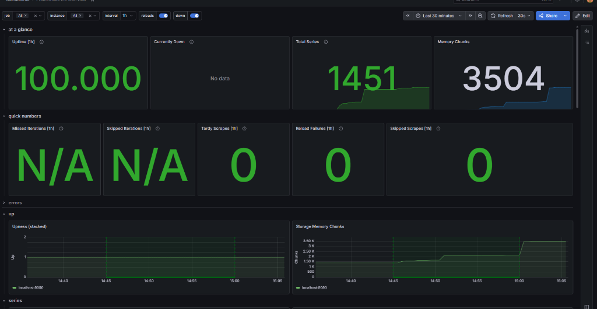

# Enterprise Stateless Private Cloud Storage

[](https://www.ansible.com/)
[](https://www.docker.com/)
[](https://nextcloud.com/)
[](https://min.io/)
[](https://redis.io/)
[](https://www.haproxy.org/)
[](https://grafana.com/)

A modern, production-grade private cloud storage solution modeled after enterprise cloud architectures. This project eliminates the **Single Point of Failure (SPOF)** of standard self-hosted storage systems by running replicated stateless Nextcloud application nodes behind a load balancer, backed by persistent database, memory cache, and S3-compatible object storage engines.

Deployment is fully automated using **Ansible Roles**, provisioning the entire stack in an idempotent manner onto **Docker containers** running inside **WSL2 (Ubuntu 22.04 LTS)**.

---

## 1. System Architecture

The infrastructure separates concerns into dedicated layers: **Routing/Load Balancing**, **Stateless Application Backend**, **Transactional Caching/Session Lock**, **Relational Metadata Storage**, **Object Storage**, and **Telemetry/Monitoring**.

### 1.1 Virtual Network Topology
The system runs within an isolated Docker bridge network (`cloud-network` under subnet `172.20.0.0/16`) to protect backend services from external exposures.

```text
    [ CLIENT BROWSER (Windows Host) ] 
                   │
                   │ HTTPS Port 443 (SSL/TLS Termination at HAProxy)
                   ▼
     +─────────────────────────────────────────────────────────────+
     | WSL2 Virtual Interface (WSL IP: 172.20.0.1 Bridge Gateway)  |
     |                                                             |
     |  +───────────────────────────────────────────────────────+  |
     |  | Docker bridge: cloud-network (Subnet: 172.20.0.0/16)  |  |
     |  |                                                       |  |
     |  |   ┌───────────────────────────────────────────────┐   |  |
     |  |   |             HAProxy LB (haproxy-lb)           |   |  |
     |  |   |             IP: 172.20.0.7 / Port 80,443      |   |  |
     |  |   └───────────────┬───────────────────────┬───────┘   |  |
     |  |                   │                       │           |  |
     |  |                   ▼ app1                  ▼ app2      |  |
     |  |          ┌────────────────┐      ┌────────────────┐   |  |
     |  |          | Nextcloud 1    |      | Nextcloud 2    |   |  |
     |  |          | 172.20.0.5:80  |      | 172.20.0.6:80  |   |  |
     |  |          └──────┬───┬─────┘      └──────┬───┬─────┘   |  |
     |  |                 │   │                   │   │         |  |
     |  |    MariaDB SQL  │   │ Redis Session     │   │         |  |
     |  |    Port 3306    │   │ Port 6379         │   │         |  |
     |  |                 ▼   └───────┐   ┌───────┘   ▼         |  |
     |  |      ┌───────────────┐      ▼   ▼      ┌───────────┐  |  |
     |  |      |  MariaDB DB   |   ┌──────────┐  | MinIO S3  |  |  |
     |  |      |  172.20.0.2   |   |  Redis   |  | 172.20.0.4|  |  |
     |  |      └───────────────┘   |172.20.0.3|  | Port 9000 |  |  |
     |  |                          └──────────┘  └───────────┘  |  |
     |  |                                              ▲        |  |
     |  |                                              │        |  |
     |  |   ┌───────────────┐      Pull Metrics        │        |  |
     |  |   |  Prometheus   |◄──Scrape (Port 1936)─────┘        |  |
     |  |   |  172.20.0.8   |                                   |  |
     |  |   └───────▲───────┘                                   |  |
     |  |           │ Pull Metrics                              |  |
     |  |   ┌───────┴───────┐                                   |  |
     |  |   |    Grafana    |                                   |  |
     |  |   |  172.20.0.9   |                                   |  |
     |  |   └───────────────┘                                   |  |
     |  +───────────────────────────────────────────────────────+  |
     +─────────────────────────────────────────────────────────────+
```

### 1.2 Data Flow Logic (Upload Sequence)
To make application servers truly stateless, data biner streams are sent directly to S3 storage, metadata is synced to MariaDB, and transaction locking is managed in-memory via Redis.

```text
Browser          HAProxy LB      Nextcloud App      Redis Cache      MariaDB DB      MinIO S3
  │                  │                 │                 │               │               │
  │───HTTPS Login───►│                 │                 │               │               │
  │                  │───Route (RR)───►│                 │               │               │
  │                  │                 │──Query User────►│               │               │
  │                  │                 │◄─Verify Hash────│               │               │
  │                  │                 │──Set Session───►│               │               │
  │                  │                 │◄──Confirm Session─│               │               │
  │◄─Set Cookie HTTP─│◄─HTTP 200 OK────│                 │               │               │
  │                  │                 │                 │               │               │
  │───HTTPS Upload──►│                 │                 │               │               │
  │                  │──Check Cookie──►│                 │               │               │
  │                  │                 │──Acquire Lock──►│               │               │
  │                  │                 │◄──Lock Granted──│               │               │
  │                  │                 │──────Simpan Metadata SQL───────►│               │
  │                  │                 │◄─────Confirm Write Success──────│               │
  │                  │                 │                                 │               │
  │                  │                 │──────────────Kirim Objek via S3 API────────────►│
  │                  │                 │◄─────────────Confirm S3 Upload Success──────────│
  │                  │                 │                                 │               │
  │                  │                 │──Release Lock─►│               │               │
  │                  │                 │◄──Lock Free─────│               │               │
  │◄──Upload Success─│◄──HTTP 200 OK───│                 │               │               │
```

---

## 2. Core Architecture Design

### 2.1 Load Balancing & SSL Termination (HAProxy)
HAProxy listening on port `80` redirects all raw HTTP traffic to `443` HTTPS. SSL/TLS termination occurs at HAProxy using a unified `.pem` certificate (Private Key + Certificate) automatically generated during deployment. 
Backend load distribution uses the `roundrobin` algorithm. To prevent session drops across backend servers, we implement **Session Stickiness** using cookie injection:
```haproxy
cookie SERVERID insert indirect nocache
server app1 nextcloud-app-1:80 check cookie app1
server app2 nextcloud-app-2:80 check cookie app2
```

### 2.2 Stateless Application Backend (Nextcloud)
We deploy two replicated Nextcloud instances (`nextcloud-app-1` and `nextcloud-app-2`) running on Apache. Rather than using persistent local storage (which limits scaling), Nextcloud's configuration is modified to treat S3-compatible MinIO as its primary storage backend. The local state is eliminated; physical files are sent straight to S3, while file lock tokens and active session variables are written to Redis.

### 2.3 Cache & Transact Session Store (Redis)
A Redis container with **Append-Only File (AOF)** persistence turned on (`redis-server --appendonly yes`) acts as:
1. **Distributed Session Store:** When HAProxy redirects traffic from `app1` to `app2` during a failover event, the user's authentication state is read directly from Redis, preventing forced logouts.
2. **File Transaction Locking:** Avoids concurrency race conditions. When a user writes a file, Nextcloud registers a transactional lock in Redis, preventing write conflicts from parallel sessions.

### 2.4 S3-Compatible Storage Backend (MinIO)
MinIO handles all unstructured binary storage. We create a bucket named `nextcloud` to host user workspaces. We expose the S3 data API internally on port `9000` (for Nextcloud integration) and map the MinIO Console dashboard externally on port `9001` for admin management.

---

## 3. Directory Layout

```text
Private-Cloud/
├── ansible/
│   ├── ansible.cfg               # Ansible defaults
│   ├── inventory.ini             # Inventory pointing to localhost WSL2
│   ├── site.yml                  # Main deployment entrypoint playbook
│   └── roles/                    # Modular playbooks
│       ├── common.yml            # System updates and base packages
│       ├── docker.yml            # Automated Docker Engine provisioning
│       ├── certificates.yml      # Self-signed certificate generator
│       ├── database.yml          # MariaDB directories and permissions
│       ├── redis.yml             # Redis persistent directory setup
│       ├── minio.yml             # MinIO object storage directory setup
│       ├── loadbalancer.yml      # HAProxy configuration setup
│       └── nextcloud.yml         # Compose trigger and stack deployment
├── config/
│   ├── haproxy/
│   │   └── haproxy.cfg           # HAProxy load balancer configuration
│   ├── nginx/
│   │   └── nginx.conf            # Nginx reverse proxy configuration (backup)
│   ├── prometheus/
│   │   └── prometheus.yml        # Prometheus polling targets configuration
│   └── grafana/
│       └── provisioning/
│           └── datasources/
│               └── datasource.yml # Pre-configured Grafana metrics source
└── docker/
    └── docker-compose.yml        # Main multi-container orchestration manifest
```

---

## 4. Getting Started

### 4.1 Prerequisites
Ensure you are running on a Linux environment or WSL2 (Ubuntu 22.04 LTS recommended) on Windows. 
You will need to install Ansible on your host controller:

```bash
sudo apt update && sudo apt upgrade -y
sudo apt install software-properties-common -y
sudo add-apt-repository --yes --update ppa:ansible/ansible
sudo apt install ansible -y
```

Verify your Ansible version (should be `2.12+`):
```bash
ansible --version
```

### 4.2 Automated Provisioning (Ansible)
Navigate to the `ansible/` folder:
```bash
cd "/mnt/c/Users/USER/Desktop/System Administator/Private-Cloud/ansible"
```

1. **Verify Playbook Syntax:**
   Ensure there are no YAML configuration typos:
   ```bash
   ansible-playbook -i inventory.ini site.yml --syntax-check
   ```

2. **Execute Deployment Playbook:**
   Run the playbook locally. The `-K` flag stands for *ask-become-pass* which prompts for your WSL2 sudo password to authorize package installations:
   ```bash
   ansible-playbook -i inventory.ini site.yml -K
   ```
   *Ansible will automatically execute the following steps:*
   * Update packages, install `ca-certificates`, `curl`, and `openssl`.
   * Register the official Docker repository keys and install Docker Engine & Compose.
   * Generate SSL Certificates and compile a unified HAProxy PEM certificate in `/opt/private-cloud/config/ssl/`.
   * Set up local persistence folders `/opt/private-cloud/{mariadb,redis,minio}`.
   * Copy load-balancer configurations.
   * Execute `docker compose up -d` to launch the multi-container stack.

---

## 5. System Operations & Lifecycle

All services are orchestrated via Docker Compose. You can manage the container lifecycle from the directory `/opt/private-cloud/docker/` or from your local project directory:

```bash
cd "/mnt/c/Users/USER/Desktop/System Administator/Private-Cloud/docker"
```

* **Start the Stack:**
  ```bash
  docker compose up -d
  ```
* **Stop Container Instances (keeps network and volume states intact):**
  ```bash
  docker compose stop
  ```
* **Bring Down System (cleans virtual networks and containers):**
  ```bash
  docker compose down
  ```
* **Restart Services:**
  ```bash
  docker compose restart
  ```
* **Check Live System Logs:**
  ```bash
  docker compose logs -f
  ```
* **View Container Status:**
  ```bash
  docker compose ps
  ```

---

## 6. Accessing Services

Once deployed, the following ports are mapped and active:

* **Nextcloud Web UI:** `https://localhost` (HTTPS)
  * *Note:* Because we are using a self-signed certificate, your browser will show a security warning. Click **Advanced** -> **Proceed to localhost (unsafe)**.
* **MinIO Console:** `http://localhost:9001`
  * **Default Credentials:** User: `minioadmin` | Password: `minioadminpassword`
* **HAProxy Stats Portal:** `http://localhost:1936`
  * **Credentials:** User: `admin` | Password: `adminstats`
* **Grafana Dashboard:** `http://localhost:3000` (Default setup for dashboard visualization).

---

## 7. High Availability & Failover Verification

Here is how you can verify and test the high-availability guarantees of this setup:

### 7.1 Testing Round-Robin Load Balancing
1. Open your browser and go to `https://localhost`.
2. Inspect the cookies using the Developer Console (F12 -> Application -> Cookies).
3. You will notice a cookie named `SERVERID` injected by HAProxy, containing either `app1` or `app2`.
4. Delete the cookie or open the site in Incognito mode; HAProxy will redirect your connection to the other app node in a round-robin cycle.

### 7.2 Testing Stateless Failover
1. Log into Nextcloud and upload a document.
2. Simulate a crash on the primary server by stopping the `nextcloud-app-1` container:
   ```bash
   docker stop nextcloud-app-1
   ```
3. Refresh the browser.
4. **Expected Behavior:** Nextcloud remains fully functional. You are **not** logged out because your session token remains preserved in the Redis Cache, and HAProxy automatically routes your requests to `nextcloud-app-2`. Your uploaded files are fully accessible since they reside in MinIO, not the stopped container.

### 7.3 Testing Auto-Recovery & Monitoring
1. Monitor HAProxy Stats at `http://localhost:1936` (auth: `admin`/`adminstats`) to see the state of `app1` change to **DOWN** (represented in red).
2. Restart the stopped server:
   ```bash
   docker start nextcloud-app-1
   ```
3. After HAProxy's TCP health checking passes (configured to verify backends on intervals), the status will shift back to **UP** (represented in green).

---

<details>
<summary>📸 Click here to view Screenshots & Verification Demos</summary>

### 1. Automated Provisioning & Docker
#### Ansible Execution Success (PLAY RECAP with `failed=0`):


#### Multi-Container Deployment Verification (`docker compose ps`):


### 2. Nextcloud Core Functions & Storage Backend
#### HTTPS Security Certification Details:


#### Administrator Portal Setup & User Creation:


#### Client Access & Upload Execution:


#### Shared Link Sharing (Public Access Verification):


#### File Deletion Verification:


#### MinIO Storage verification:


### 3. Load Balancing & Cluster Resiliency
#### HAProxy Backend Status Portal:


#### Round Robin Active Client Switching:


#### Simulating Node Failure (Crash Simulation):


#### Failover Verification (Services Stay Up, No Re-authentication Required):


#### Node Recovery & Re-insertion:


#### System Resource Telemetry (Prometheus & Grafana):



</details>
