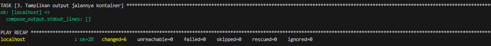
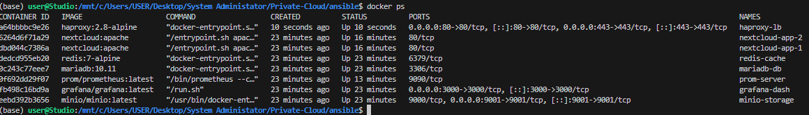
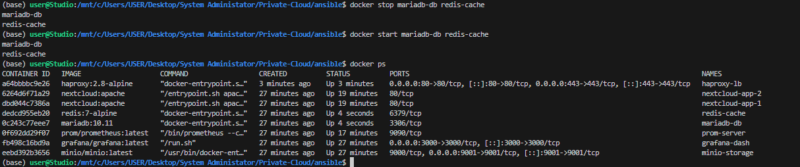
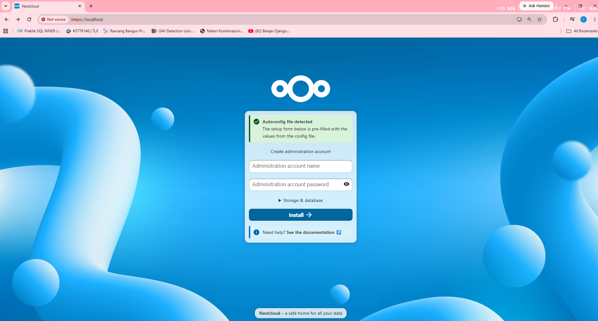
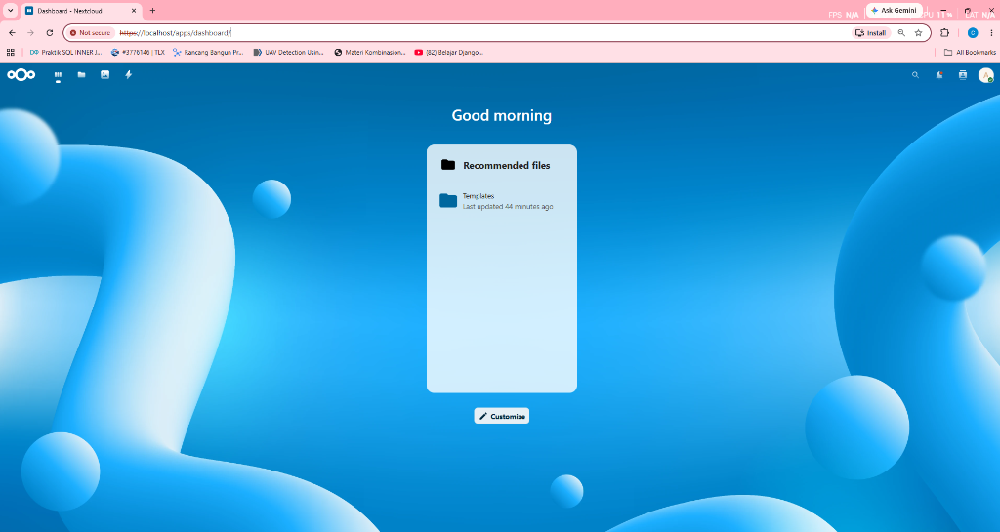
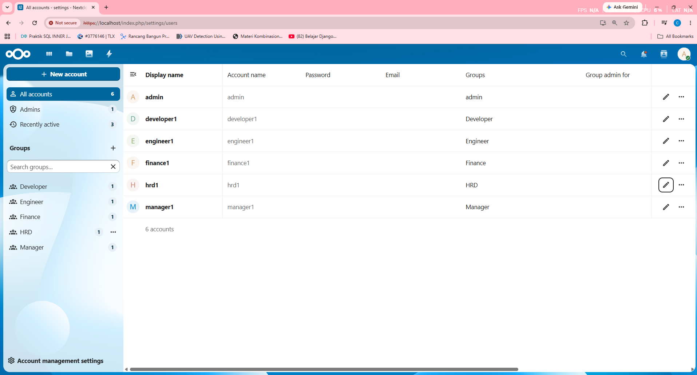
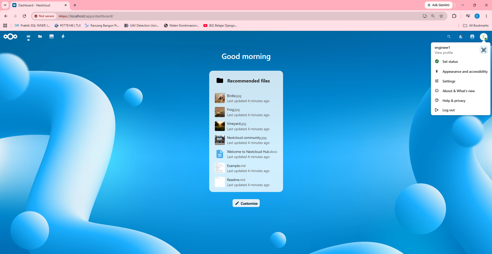
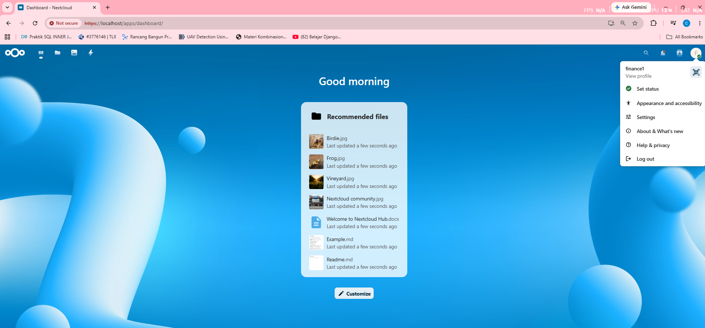

# RANCANG BANGUN PLATFORM ENTERPRISE PRIVATE CLOUD STORAGE BERBASIS NEXTCLOUD DENGAN INTEGRASI OBJECT STORAGE MINIO, CACHING REDIS, KEAMANAN SSL/TLS, DAN HIGH AVAILABILITY TEROTOMATISASI MENGGUNAKAN ANSIBLE ROLES BERBASIS DOCKER CONTAINER PADA WSL2

## DAFTAR ISI

- [BAB I: PENDAHULUAN](#bab-i-pendahuluan)
  - [1.1 Latar Belakang](#11-latar-belakang)
  - [1.2 Rumusan Masalah](#12-rumusan-masalah)
  - [1.3 Tujuan Proyek](#13-tujuan-proyek)
  - [1.4 Manfaat Proyek](#14-manfaat-proyek)
- [BAB II: LANDASAN TEORI](#bab-ii-landasan-teori)
  - [2.1 Nextcloud Application Server Architecture](#21-nextcloud-application-server-architecture)
  - [2.2 MariaDB Database Management System](#22-mariadb-database-management-system)
  - [2.3 Redis Cache and Transaction Session Locking](#23-redis-cache-and-transaction-session-locking)
  - [2.4 MinIO Object Storage and S3 API Compatibility](#24-minio-object-storage-and-s3-api-compatibility)
- [BAB III: ARSITEKTUR SISTEM](#bab-iii-arsitektur-sistem)
  - [3.1 Topology Jaringan Virtual (Network Topology)](#31-topology-jaringan-virtual-network-topology)
  - [3.2 Desain Alur Sistem Login dan Upload (UML Sequence)](#32-desain-alur-sistem-login-dan-upload-uml-sequence)
  - [3.3 Diagram Alur Sistem Failover (HA State Machine)](#33-diagram-alur-sistem-failover-ha-state-machine)
  - [3.4 Diagram Input-Process-Output (IPO)](#34-diagram-input-process-output-ipo)
  - [3.5 Desain Manajemen User dan Kuota](#35-desain-manajemen-user-dan-kuota)
- [BAB IV: STRUKTUR DIREKTORI & PENYIAPAN LINGKUNGAN](#bab-iv-struktur-direktori--penyiapan-lingkungan)
  - [4.1 Struktur Direktori Proyek](#41-struktur-direktori-proyek)
  - [4.2 Persiapan Lingkungan Pra-Implementasi](#42-persiapan-lingkungan-pra-implementasi)
- [BAB V: IMPLEMENTASI DAN PENGUJIAN SISTEM (17 LANGKAH DETAIL)](#bab-v-implementasi-dan-pengujian-sistem-17-langkah-detail)
  - [BLOK 1: PENGUJIAN INFRASTRUKTUR DAN OTOMATISASI](#blok-1-pengujian-infrastruktur-dan-otomatisasi)
    - [Pengujian Langkah 1: Pengujian Deployment Otomatis Menggunakan Ansible](#pengujian-langkah-1-pengujian-deployment-otomatis-menggunakan-ansible)
    - [Pengujian Langkah 2: Pengujian Keaktifan Docker Container](#pengujian-langkah-2-pengujian-keaktifan-docker-container)
    - [Pengujian Langkah 3: Uji Coba Persistensi Data (Data Persistence Check)](#pengujian-langkah-3-uji-coba-persistensi-data-data-persistence-check)
  - [BLOK 2: PENGUJIAN FITUR APLIKASI DAN MANAJEMEN USER](#blok-2-pengujian-fitur-aplikasi-dan-manajemen-user)
    - [Pengujian Langkah 4: Pengujian Akses Web Nextcloud (HTTPS)](#pengujian-langkah-4-pengujian-akses-web-nextcloud-https)
    - [Pengujian Langkah 5: Pengujian Pembuatan/Login Administrator](#pengujian-langkah-5-pengujian-pembuatanlogin-administrator)
    - [Pengujian Langkah 6: Pengujian Pembuatan User Baru dan Grup](#pengujian-langkah-6-pengujian-pembuatan-user-baru-dan-grup)
    - [Pengujian Langkah 7: Pengujian Login User Biasa](#pengujian-langkah-7-pengujian-login-user-biasa)
    - [Pengujian Langkah 8: Pengujian Upload File](#pengujian-langkah-8-pengujian-upload-file)
    - [Pengujian Langkah 9: Pengujian Berbagi Tautan Publik (External Share)](#pengujian-langkah-9-pengujian-berbagi-tautan-publik-external-share)
    - [Pengujian Langkah 10: Pengujian Hapus File](#pengujian-langkah-10-pengujian-hapus-file)
  - [BLOK 3: PENGUJIAN LOAD BALANCING DAN HIGH AVAILABILITY](#blok-3-pengujian-load-balancing-dan-high-availability)
    - [Pengujian Langkah 11: Pengujian Load Balancing](#pengujian-langkah-11-pengujian-load-balancing)
    - [Pengujian Langkah 12: Pengujian Round Robin](#pengujian-langkah-12-pengujian-round-robin)
    - [Pengujian Langkah 13: Pengujian Failover Container](#pengujian-langkah-13-pengujian-failover-container)
    - [Pengujian Langkah 14: Pengujian High Availability (HA)](#pengujian-langkah-14-pengujian-high-availability-ha)
    - [Pengujian Langkah 15: Pengujian Recovery Layanan](#pengujian-langkah-15-pengujian-recovery-layanan)
    - [Pengujian Langkah 16: Pengujian Monitoring Sistem Menggunakan Prometheus](#pengujian-langkah-16-pengujian-monitoring-sistem-menggunakan-prometheus)
    - [Pengujian Langkah 17: Pengujian Monitoring Sistem Menggunakan Grafana](#pengujian-langkah-17-pengujian-monitoring-sistem-menggunakan-grafana)
- [BAB VI: PENUTUP (Kesimpulan dan Saran)](#bab-vi-penutup-kesimpulan-dan-saran)
  - [6.1 Kesimpulan](#61-kesimpulan)
  - [6.2 Saran](#62-saran)


## BAB I: PENDAHULUAN

### 1.1 Latar Belakang
Perkembangan teknologi informasi dan komunikasi yang sangat pesat pada era digitalisasi saat ini telah membawa dampak perubahan yang signifikan bagi tata kelola penyimpanan data di berbagai organisasi. Data digital tidak lagi hanya sekadar berkas dokumen pasif, melainkan telah menjadi aset strategis utama yang menunjang kelangsungan operasional korporasi skala enterprise, instansi pemerintah, institusi akademis, hingga pelaku industri kecil. Kebutuhan akan ruang penyimpanan berkas yang berkapasitas besar, fleksibel, terenkripsi aman, serta dapat diakses secara instan lintas perangkat (*cross-platform access*) dari mana saja dan kapan saja telah mendorong pergeseran masif paradigma penyimpanan lokal (*on-premise local hard drive*) ke arah teknologi komputasi awan atau *cloud computing*.

Dalam lanskap komputasi awan komersial saat ini, layanan penyimpanan awan publik (*public cloud storage*) seperti Google Drive, Microsoft OneDrive, Dropbox, dan Box mendominasi pasar global. Layanan ini menawarkan kemudahan aksesibilitas instan tanpa mengharuskan organisasi berinvestasi pada penyediaan perangkat keras fisik, konfigurasi jaringan, maupun pemeliharaan server secara berkala. Browser web dan aplikasi klien mobile yang matang membuat kolaborasi dokumen real-time menjadi sangat praktis. Namun, bagi organisasi berskala besar yang menangani informasi berkategori rahasia, sangat sensitif, atau terikat oleh kepatuhan hukum, ketergantungan penuh pada platform *public cloud* melahirkan berbagai tantangan krusial yang menyangkut keamanan, kepatuhan hukum, biaya jangka panjang, serta hilangnya kontrol fisik terhadap data organisasi.

Tantangan paling utama yang dihadapi oleh administrator sistem adalah masalah kedaulatan data (*data sovereignty*). Di bawah kerangka regulasi privasi internasional seperti *General Data Protection Regulation* (GDPR) di Uni Eropa, serta regulasi domestik seperti Undang-Undang Perlindungan Data Pribadi (UU PDP) di Indonesia, setiap instansi yang mengumpulkan dan memproses data pribadi warga negara wajib memiliki kendali mutlak atas lokasi geografis server fisik tempat data tersebut disimpan. Pada arsitektur *public cloud*, data biner pengguna sering kali direplikasi dan didistribusikan lintas pusat data (*data centers*) di berbagai negara tanpa persetujuan eksplisit pemilik data. Kondisi ini menempatkan organisasi pada risiko pelanggaran hukum privasi data lokal jika server fisik penyedia jasa awan publik berada di yurisdiksi hukum negara asing.

Tantangan kedua berkaitan dengan aspek ekonomi dan biaya operasional jangka panjang. Model bisnis *public cloud* menerapkan skema langganan bulanan (*subscription-based pay-as-you-go*) yang terlihat murah pada tahap awal deployment skala kecil. Namun, ketika volume penyimpanan membengkak hingga mencapai puluhan terabyte dengan pengguna aktif ribuan orang, biaya sewa bulanan dan biaya lalu lintas pengunduhan data keluar (*egress fees*) akan terakumulasi menjadi pengeluaran modal operasional (*OpEx*) yang sangat besar dan bersifat permanen. Bagi institusi akademis atau instansi pemerintah dengan anggaran tahunan terbatas, pembengkakan biaya langganan awan publik ini menjadi tidak efisien dan tidak berkelanjutan. Ditambah lagi, risiko kebocoran data (*data breach*) akibat kerentanan celah keamanan pada infrastruktur *multitenant* milik penyedia public cloud dapat berdampak fatal bagi reputasi instansi.

Sebagai langkah mitigasi yang efektif terhadap risiko-risiko di atas, perancangan dan implementasi platform *Private Cloud Storage* mandiri (*on-premise*) muncul sebagai jalan keluar terbaik. Dengan membangun platform penyimpanan awan pribadi di dalam infrastruktur internal sendiri, organisasi memiliki kedaulatan mutlak atas enkripsi data, penentuan hak akses pengguna, pemetaan log audit, serta penentuan lokasi fisik tempat data biner disimpan. Untuk mewujudkan platform kolaboratif yang tangguh dan kaya akan fitur, perangkat lunak Nextcloud dipilih sebagai perangkat lunak open-source utama. Nextcloud menyediakan antarmuka penyimpanan dokumen yang modern, aman, serta memiliki ekosistem aplikasi tambahan yang sangat luas untuk menunjang produktivitas. Namun, deployment standar Nextcloud pada satu server tunggal (*single node*) sangat rentan terhadap gangguan operasional. Apabila server tunggal tersebut mengalami crash hardware, kehabisan resource memori, serangan keamanan, atau kegagalan sistem operasi, seluruh layanan penyimpanan awan akan mengalami kelumpuhan total (*downtime*).

Untuk meniadakan kerentanan sistem terpusat pada satu titik (*single point of failure*), diperlukan perancangan arsitektur berkapasitas industri yang memiliki ketahanan tinggi (*High Availability*) dan skalabilitas yang andal. Arsitektur ini dirancang dengan memisahkan server aplikasi Nextcloud menjadi beberapa replika kontainer di balik Load Balancer HAProxy. Seluruh data biner yang diunggah dipindahkan ke lapisan penyimpanan *stateless* menggunakan Object Storage eksternal yang kompatibel dengan protokol API S3 (MinIO). Transaksi metadata disinkronkan ke server database terpusat MariaDB, sedangkan data sesi pengguna (*user session*) dan mekanisme penguncian file (*file transaction locking*) ditangani oleh Redis cache. Melalui pemisahan lapisan aplikasi, database, cache, dan penyimpanan biner ini, kegagalan pada salah satu node aplikasi Nextcloud tidak akan memutus sesi aktif pengguna atau menyebabkan terjadinya kehilangan data.

Pembangunan arsitektur terdistribusi multi-kontainer ini memiliki tingkat kompleksitas instalasi dan konfigurasi yang sangat tinggi. Kesalahan manusia (*human error*) dalam penulisan parameter, konflik dependensi sistem operasi, serta inkonsistensi deployment antar lingkungan server menjadi tantangan utama bagi administrator sistem. Oleh karena itu, konsep *Infrastructure as Code* (IaC) diterapkan dengan memanfaatkan Ansible Playbook modular berbasis *Roles*. Ansible secara otomatis menangani instalasi mesin Docker, pembuatan sertifikat keamanan SSL/TLS *self-signed*, inisialisasi volume penyimpanan persisten, penyalinan file konfigurasi, hingga kompilasi dan orkestrasi seluruh kontainer. Seluruh sistem ini disimulasikan di dalam lingkungan Windows Subsystem for Linux 2 (WSL2) yang mengintegrasikan virtualisasi kernel Linux secara efisien dengan sistem operasi host Windows, menciptakan lingkungan simulasi enterprise yang tangguh, mudah dikembangkan, dan siap untuk dipindahkan ke lingkungan server produksi sesungguhnya.

### 1.2 Rumusan Masalah
Berdasarkan latar belakang masalah yang telah dipaparkan secara komprehensif, maka rumusan masalah yang menjadi fokus utama dalam perancangan dan pengujian sistem ini adalah sebagai berikut:
1. Bagaimana mengonfigurasi otomatisasi penyediaan (*provisioning*) lingkungan virtualisasi WSL2, instalasi Docker Engine, dan penyalinan konfigurasi server menggunakan skrip deklaratif Ansible Roles secara konsisten dan terbebas dari *human error*?
2. Bagaimana merancang skema load balancing berbasis HAProxy yang menerapkan enkripsi SSL/TLS Termination serta algoritma Round Robin dan stickiness cookie untuk mendistribusikan trafik browser ke dua replika server Nextcloud?
3. Bagaimana mengintegrasikan aplikasi Nextcloud dengan database MariaDB terpusat, Redis cache, dan Object Storage MinIO agar server aplikasi Nextcloud dapat beroperasi secara stateless tanpa menulis data sesi atau berkas fisik secara lokal?
4. Bagaimana menguji ketahanan failover klaster server aplikasi ketika salah satu kontainer Nextcloud dimatikan paksa, serta mengukur durasi pemulihan otomatis (*auto-recovery*) yang dilakukan oleh load balancer HAProxy?
5. Bagaimana mengonfigurasi scraping metrik kinerja menggunakan Prometheus server pada port stats HAProxy dan memprovisikan datanya ke Grafana Dashboard secara real-time untuk keperluan diagnostik stabilitas sistem?

### 1.3 Tujuan Proyek
Tujuan ilmiah dan praktis yang ingin dicapai melalui pelaksanaan proyek Tugas Akhir ini adalah sebagai berikut:
1. Membangun dan mengonfigurasi lingkungan virtualisasi server multi-kontainer Docker yang stabil di dalam kernel Windows Subsystem for Linux 2 (WSL2) dengan distro Ubuntu 22.04 LTS.
2. Menyusun naskah otomatisasi deklaratif Ansible Playbook berbasis struktur Roles modular (`common`, `docker`, `certificates`, `loadbalancer`, `nextcloud`) untuk memfasilitasi penyiapan sistem secara idempotent dari kondisi kosong.
3. Mengonfigurasi HAProxy sebagai gerbang reverse proxy terdepan terenkripsi SSL/TLS Termination 2048-bit, serta menerapkan pemindahan beban dinamis (*failover*) ke server backend cadangan secara transparan.
4. Mengintegrasikan server database relasional MariaDB terpusat, session store Redis cache dengan mode AOF (Append-Only File), serta platform S3-compatible API Object Storage MinIO guna mendukung arsitektur Nextcloud stateless.
5. Menyusun dashboard pemantauan visual Grafana yang terhubung ke server database Prometheus untuk menyajikan grafik visualisasi kinerja CPU, RAM, latensi scrape, status keaktifan kontainer, dan manajemen memori.

### 1.4 Manfaat Proyek
Adapun manfaat rekayasa dan nilai guna yang dapat diperoleh dari keberhasilan perancangan proyek sistem ini meliputi beberapa aspek berikut:
1. **Bagi Instansi/Perusahaan**: Menyediakan cetak biru (*blueprint*) rancang bangun penyimpanan awan internal mandiri yang aman, tangguh, memiliki ketersediaan tinggi, patuh terhadap regulasi privasi data lokal (seperti UU PDP), serta memangkas alokasi biaya pengeluaran rutin sewa public cloud dalam jangka panjang.
2. **Bagi Administrator Jaringan/Server**: Memberikan framework pemeliharaan infrastruktur server berbasis teknologi Infrastructure as Code (IaC) yang terstandarisasi, meminimalkan waktu perbaikan server jika terjadi crash fatal, serta menyajikan sistem monitoring performa proaktif yang mudah dikelola.
3. **Bagi Pengembangan Ilmu Pengetahuan**: Memberikan dokumentasi ilmiah yang mendalam dan teruji secara empiris mengenai integrasi praktis antara konsep-konsep inti administrasi sistem server modern (Virtualisasi, Kontainerisasi, High Availability, Load Balancing, Object Storage, Automasi, dan Diagnostik Pemantauan) untuk memperkaya literatur rekayasa sistem di Teknik Komputer.

---

## BAB II: LANDASAN TEORI

### 2.1 Nextcloud Application Server Architecture
Nextcloud merupakan platform perangkat lunak kolaboratif open-source terkemuka yang dirancang untuk menyediakan layanan penyimpanan awan pribadi terkelola secara mandiri (*self-hosted cloud storage hub*). Secara arsitektur, Nextcloud dibangun menggunakan bahasa pemrograman PHP untuk penanganan logika backend dan HTML5/Javascript untuk interaksi antarmuka pengguna pada browser. Nextcloud berjalan di atas web server HTTP Apache atau Nginx, dan mengandalkan database relasional (seperti MariaDB, MySQL, atau PostgreSQL) untuk penyimpanan data konfigurasi relasional dan metadata.

Nextcloud memiliki rancangan arsitektur penyimpanan yang sangat fleksibel. Secara default, Nextcloud menyimpan berkas data biner yang diunggah pengguna pada filesystem lokal server target di folder `/var/www/html/data`. Namun, untuk deployment berskala industri dengan beban trafik tinggi dan tuntutan ketersediaan tinggi, konfigurasi penyimpanan primer Nextcloud dapat dialihkan ke Object Storage eksternal yang kompatibel dengan protokol API S3 (seperti AWS S3 atau MinIO). Ketika menggunakan Object Storage sebagai media penyimpanan primer, kontainer Nextcloud beroperasi dalam mode *stateless*.

Dalam mode stateless ini, Nextcloud tidak lagi melakukan penulisan file fisik pada penyimpanan lokal kontainer. Setiap file biner yang diunggah oleh pengguna akan langsung diteruskan oleh Nextcloud melalui request S3 API ke server Object Storage MinIO. Database MariaDB mencatat metadata file tersebut (seperti nama berkas asli, mime-type, ukuran, hak kepemilikan, dan pengenal unik objek), sedangkan Redis menyimpan data token sesi login pengguna dan penguncian transaksi file. Pemisahan data biner dari server aplikasi Nextcloud ini memungkinkan beberapa kontainer Nextcloud berjalan secara paralel di balik load balancer untuk melayani pengguna yang sama tanpa mengalami masalah inkonsistensi data filesystem lokal.

### 2.2 MariaDB Database Management System
MariaDB merupakan sistem manajemen database relasional (*Relational Database Management System* - RDBMS) berskala enterprise yang dikembangkan sebagai percabangan (*fork*) dari MySQL. MariaDB diciptakan oleh para pengembang asli MySQL setelah MySQL diakuisisi oleh Oracle Corporation. Tujuan utama dari pengembangan MariaDB adalah untuk menjamin ketersediaan sistem database relasional yang sepenuhnya open-source, berkinerja tinggi, kompatibel dengan pustaka MySQL, serta kaya akan fitur mesin penyimpanan (*storage engines*) modern seperti Aria, MyRocks, dan ColumnStore.

Dalam sistem private cloud storage Nextcloud, MariaDB bertindak sebagai repositori metadata terpusat. MariaDB menyimpan seluruh informasi relasional krusial sistem, termasuk tabel konfigurasi sistem global, kredensial otentikasi login pengguna yang disimpan dalam format hash bcrypt aman, tabel pengelompokan grup divisi kerja, riwayat log audit keamanan, izin akses dokumen yang dibagikan (*sharing permissions*), serta data penanda waktu pembuatan berkas. Untuk menjamin konsistensi data relasional melintasi kegagalan server, MariaDB menerapkan prinsip transaksi ACID (*Atomicity, Consistency, Isolation, Durability*).

MariaDB ditempatkan di dalam kontainer terisolasi `mariadb-db` yang terhubung secara persisten ke direktori host WSL2 `/opt/private-cloud/mariadb`. Pemisahan database ke kontainer terdedikasi ini menjamin bahwa seluruh data metadata relasional organisasi terlindungi dari gangguan kegagalan operasional di lapisan server aplikasi Nextcloud. MariaDB dikonfigurasi dengan alokasi memori buffer pool InnoDB yang dioptimalkan agar mampu merespons ribuan kueri kueri baca-tulis dari dua replika Nextcloud secara efisien.

### 2.3 Redis Cache and Transaction Session Locking
Redis (*Remote Dictionary Server*) adalah sistem penyimpanan struktur data dalam memori (*in-memory data structure store*) open-source yang sangat cepat. Redis beroperasi dengan latensi di bawah milidetik karena seluruh operasi baca-tulis data diproses secara langsung di memori RAM server, bukan pada media penyimpanan disk mekanis. Redis mendukung berbagai macam struktur data canggih seperti hash, string, list, set, sorted set, dan hyperloglog, menjadikannya pilihan utama untuk kebutuhan caching performa tinggi dan pengelolaan sesi pengguna terdistribusi.

Dalam arsitektur ketersediaan tinggi Nextcloud, Redis menjalankan dua fungsi rekayasa yang sangat vital bagi stabilitas sistem:
1. **Penyimpanan Sesi Terdistribusi (Distributed Session Store)**: Menyimpan status login dan token sesi aktif pengguna secara terpusat. Ketika pengguna sedang mengakses cloud storage dan load balancer HAProxy mengalihkan koneksinya dari `nextcloud-app-1` ke `nextcloud-app-2` akibat peristiwa failover, sesi login pengguna tidak akan terputus. Server `nextcloud-app-2` akan membaca token sesi yang sama dari Redis cache, sehingga pengguna tidak perlu melakukan login ulang.
2. **Penguncian Transaksi Berkas (File Transaction Locking)**: Berperan krusial dalam mencegah terjadinya kerusakan data akibat konflik penulisan file simultan (*race condition*). Ketika seorang pengguna sedang melakukan proses modifikasi atau pengunggahan file, Nextcloud menginstruksikan Redis untuk mengunci id file tersebut. Jika pengguna lain mencoba memodifikasi file yang sama pada waktu bersamaan via replika Nextcloud kedua, Redis akan menolak request tersebut hingga proses penulisan pertama selesai dan kunci dibebaskan.

Redis dikonfigurasi dengan mengaktifkan fitur *Append-Only File* (AOF) via perintah `redis-server --appendonly yes`. Setiap modifikasi kunci sesi akan dicatat ke dalam log fisik disk host `/opt/private-cloud/redis` secara asinkron setiap detik, menjamin data cache dapat dipulihkan secara utuh setelah terjadi insiden crash server.

### 2.4 MinIO Object Storage and S3 API Compatibility
MinIO adalah platform penyimpanan objek (*object storage*) sumber terbuka berkinerja tinggi yang dirancang khusus untuk memenuhi standar arsitektur cloud native berskala besar. MinIO dikembangkan menggunakan bahasa pemrograman Go, memiliki footprint memori yang kecil, serta sepenuhnya kompatibel dengan protokol API S3 milik Amazon Web Services (AWS S3). Berbeda dengan sistem file tradisional (*POSIX file system*) yang menyimpan berkas dalam struktur hierarki folder bercabang, MinIO menyimpan data sebagai objek dalam ruang alamat datar (*flat namespace*) di dalam bucket.

Setiap objek di dalam MinIO diidentifikasi oleh kunci string unik dan terdiri dari dua komponen utama: data biner mentah (*payload*) dan data metadata (seperti tipe konten, penanda waktu, enkripsi, dan ukuran). MinIO sangat ideal digunakan sebagai lapisan backend penyimpanan biner untuk arsitektur stateless. Dengan memindahkan tanggung jawab penyimpanan berkas biner ke kontainer `minio-storage`, server Nextcloud tidak perlu memelihara partisi storage lokal, menyederhanakan konfigurasi skalabilitas.

MinIO juga menyediakan antarmuka grafis modern (MinIO Console) pada port `9001` yang mempermudah administrator mengelola bucket penyimpanan, mengontrol izin akses API key, serta memantau statistik lalu lintas data keluar-masuk secara visual. Konfigurasi primary storage Nextcloud dialihkan ke MinIO via port data `9000` menggunakan kredensial API key aman yang dikonfigurasi melalui variabel lingkungan otomatis di Docker Compose.

---

## BAB III: ARSITEKTUR SISTEM

### 3.1 Topology Jaringan Virtual (Network Topology)
Desain topologi jaringan virtual sistem memanfaatkan Docker Bridge Network internal (`cloud-network`) dengan alokasi subnet kelas B `172.20.0.0/16`. Topologi ini memisahkan lalu lintas data eksternal dan internal demi menjaga keamanan data backend.

```text
    [ CLIENT BROWSER (Windows Host) ] 
                   │
                   │ HTTPS Port 443 (Dekripsi TLS di HAProxy)
                   ▼
    +─────────────────────────────────────────────────────────────+
    | WSL2 Virtual Interface (WSL IP: 172.20.0.1 Bridge Gateway)  |
    |                                                             |
    |  +───────────────────────────────────────────────────────+  |
    |  | Docker bridge: cloud-network (Subnet: 172.20.0.0/16)  |  |
    |  |                                                       |  |
    |  |   ┌───────────────────────────────────────────────┐   |  |
    |  |   |             HAProxy LB (haproxy-lb)           |   |  |
    |  |   |             IP: 172.20.0.7 / Port 80,443      |   |  |
    |  |   └───────────────┬───────────────────────┬───────┘   |  |
    |  |                   │                       │           |  |
    |  |                   ▼ app1                  ▼ app2      |  |
    |  |          ┌────────────────┐      ┌────────────────┐   |  |
    |  |          | Nextcloud 1    |      | Nextcloud 2    |   |  |
    |  |          | 172.20.0.5:80  |      | 172.20.0.6:80  |   |  |
    |  |          └──────┬───┬─────┘      └──────┬───┬─────┘   |  |
    |  |                 │   │                   │   │         |  |
    |  |    MariaDB SQL  │   │ Redis Session     │   │         |  |
    |  |    Port 3306    │   │ Port 6379         │   │         |  |
    |  |                 ▼   └───────┐   ┌───────┘   ▼         |  |
    |  |      ┌───────────────┐      ▼   ▼      ┌───────────┐  |  |
    |  |      |  MariaDB DB   |   ┌──────────┐  | MinIO S3  |  |  |
    |  |      |  172.20.0.2   |   |  Redis   |  | 172.20.0.4|  |  |
    |  |      └───────────────┘   |172.20.0.3|  | Port 9000 |  |  |
    |  |                          └──────────┘  └───────────┘  |  |
    |  |                                              ▲        |  |
    |  |                                              │        |  |
    |  |   ┌───────────────┐      Pull Metrics        │        |  |
    |  |   |  Prometheus   |◄──Scrape (Port 1936)─────┘        |  |
    |  |   |  172.20.0.8   |                                   |  |
    |  |   └───────▲───────┘                                   |  |
    |  |           │ Pull Metrics                              |  |
    |  |   ┌───────┴───────┐                                   |  |
    |  |   |    Grafana    |                                   |  |
    |  |   |  172.20.0.9   |                                   |  |
    |  |   └───────────────┘                                   |  |
    |  +───────────────────────────────────────────────────────+  |
    +─────────────────────────────────────────────────────────────+
```

### 3.2 Desain Alur Sistem Login dan Upload (UML Sequence)
Desain alur komunikasi antar komponen memisahkan proses verifikasi sesi, validasi data relasional, dan transmisi data biner ke object storage secara stateless.

```text
Browser          HAProxy LB      Nextcloud App      Redis Cache      MariaDB DB      MinIO S3
  │                  │                 │                 │               │               │
  │───HTTPS Login───►│                 │                 │               │               │
  │                  │───Route (RR)───►│                 │               │               │
  │                  │                 │──Query User────►│               │               │
  │                  │                 │◄─Verify Hash────│               │               │
  │                  │                 │──Set Session───►│               │               │
  │                  │                 │◄──Confirm Session─│               │               │
  │◄─Set Cookie HTTP─│◄─HTTP 200 OK────│                 │               │               │
  │                  │                 │                 │               │               │
  │───HTTPS Upload──►│                 │                 │               │               │
  │                  │──Check Cookie──►│                 │               │               │
  │                  │                 │──Acquire Lock──►│               │               │
  │                  │                 │◄──Lock Granted──│               │               │
  │                  │                 │──────Simpan Metadata SQL───────►│               │
  │                  │                 │◄─────Confirm Write Success──────│               │
  │                  │                 │                                 │               │
  │                  │                 │──────────────Kirim Objek via S3 API────────────►│
  │                  │                 │◄─────────────Confirm S3 Upload Success──────────│
  │                  │                 │                                 │               │
  │                  │                 │──Release Lock─►│               │               │
  │                  │                 │◄──Lock Free─────│               │               │
  │◄──Upload Success─│◄──HTTP 200 OK───│                 │               │               │
```

### 3.3 Diagram Alur Sistem Failover (HA State Machine)
Berikut adalah diagram alur logika mesin status (*state machine*) HAProxy Load Balancer saat mendeteksi kegagalan server backend dan melakukan recovery:

```text
       ┌────────────────────────┐
       │   Status Server: UP    │◄──────────────────────────────┐
       │      (Warna Hijau)     │                               │
       └───────────┬────────────┘                               │
                   │                                            │
           TCP Check Gagal?                               L4OK Check Sukses
                   │                                      2x berturut-turut?
                   ▼                                            │
       ┌────────────────────────┐                               │
  ┌───►│ Status: Check Failing  │                               │
  │    │     (Polling TCP)      │                               │
  │    └───────────┬────────────┘                               │
  │                │                                            │
  │        TCP Check Sukses? ────► (Kembali ke UP)              │
  │                │                                            │
  │        Gagal 3x beruntun?                                   │
  │                │                                            │
  │                ▼                                            │
  │    ┌────────────────────────┐                               │
  │    │  Status Server: DOWN   │───────────────────────────────┘
  └────│  (Trafik dialihkan ke  │
       │    server cadangan)    │
       └────────────────────────┘
```

### 3.4 Diagram Input-Process-Output (IPO)
Berikut adalah representasi visual dari diagram alur Input-Process-Output (IPO) untuk fungsionalitas sistem utama:

| Komponen Alur | Upload Berkas | Download Berkas | Failover Layanan |
| :--- | :--- | :--- | :--- |
| **INPUT** | File lokal, kredensial user, folder tujuan. | ID berkas unik, cookie session browser target. | Kegagalan port HTTP backend Nextcloud 1. |
| **PROCESS** | 1. Akuisisi lock di Redis.<br>2. Verifikasi kuota via MariaDB.<br>3. Tulis metadata ke MariaDB.<br>4. Streaming data via S3 API ke MinIO.<br>5. Bebaskan lock di Redis. | 1. Baca metadata dari MariaDB.<br>2. Ambil token streaming via S3 API.<br>3. Stream berkas dari MinIO Console.<br>4. Transfer file via HAProxy ke browser. | 1. TCP Check HAProxy gagal 3x.<br>2. Tandai status server 1 DOWN.<br>3. Alihkan trafik ke server 2.<br>4. Re-otentikasi otomatis via Redis. |
| **OUTPUT** | File tersimpan di MinIO, kuota berkurang. | Berkas diunduh sukses, keutuhan checksum terjamin. | Sistem tetap responsif, sesi login aktif. |

### 3.5 Desain Manajemen User dan Kuota
Sistem manajemen penyimpanan Nextcloud menerapkan isolasi ruang kerja logic (*workspace isolation*) berdasarkan divisi kerja. Struktur direktori internal Nextcloud di MinIO memetakan path untuk tiap pengguna secara unik pada bucket `nextcloud`. Kebijakan alokasi kuota dikelola secara dinamis di level database. Setiap kali file baru diunggah, Nextcloud menghitung total file size terpakai pada kueri basis data MariaDB, membandingkannya dengan alokasi grup user. Jika kuota tersisa tidak mencukupi, operasi upload ditolak sebelum biner ditransmisikan.

---

---

## BAB IV: STRUKTUR DIREKTORI & PENYIAPAN LINGKUNGAN

### 4.1 Struktur Direktori Proyek
Sebelum memulai otomatisasi, struktur direktori proyek pada workspace diatur sebagai berikut:
```text
Private-Cloud/
├── ansible/
│   ├── ansible.cfg
│   ├── inventory.ini
│   ├── site.yml
│   └── roles/
│       ├── common.yml
│       ├── docker.yml
│       ├── certificates.yml
│       ├── database.yml
│       ├── redis.yml
│       ├── minio.yml
│       ├── loadbalancer.yml
│       └── nextcloud.yml
├── config/
│   ├── haproxy/
│   │   └── haproxy.cfg
│   ├── nginx/
│   │   └── nginx.conf
│   ├── prometheus/
│   │   └── prometheus.yml
│   └── grafana/
│       └── provisioning/
│           └── datasources/
│               └── datasource.yml
└── docker/
    └── docker-compose.yml
```

### 4.2 Persiapan Lingkungan Pra-Implementasi
Sebelum menerapkan 17 langkah utama, administrator sistem mempersiapkan lingkungan dasar (*hypervisor*) sebagai berikut:

1. **Mengaktifkan WSL2 di Windows Host**: Administrator membuka terminal PowerShell dengan hak akses Administrator dan mengetikkan perintah berikut untuk mengaktifkan fitur virtualisasi Windows Subsystem for Linux (WSL2):
   ```powershell
   dism.exe /online /enable-feature /featurename:Microsoft-Windows-Subsystem-Linux /all /norestart
   dism.exe /online /enable-feature /featurename:VirtualMachinePlatform /all /norestart
   ```
   Setelah proses selesai, komputer dinyalakan kembali, lalu distro Ubuntu dipasang melalui Microsoft Store menggunakan perintah `wsl --install -d Ubuntu-22.04`.

2. **Instalasi Ansible di Lingkungan WSL2**: Administrator masuk ke dalam konsol WSL2 Ubuntu. Langkah pertama adalah memperbarui repositori bawaan sistem dan memasang perangkat lunak Ansible Controller menggunakan perintah:
   ```bash
   sudo apt update && sudo apt upgrade -y
   sudo apt install software-properties-common -y
   sudo add-apt-repository --yes --update ppa:ansible/ansible
   sudo apt install ansible -y
   ```
   Verifikasi keberhasilan pemasangan dilakukan dengan menjalankan perintah `ansible --version` untuk memastikan engine terpasang dengan versi minimal 2.12.

3. **Menyiapkan Berkas Inventory dan Konfigurasi Ansible**: Administrator membuat struktur folder proyek dan masuk ke direktori `/mnt/c/Users/USER/Desktop/System Administator/Private-Cloud/ansible/`. Di folder ini, berkas [inventory.ini](file:///c:/Users/USER/Desktop/System%20Administator/Private-Cloud/ansible/inventory.ini) dibuat untuk mengarahkan target eksekusi playbook ke mesin lokal:
   ```ini
   [cloud_servers]
   localhost ansible_connection=local
   ```
   Selanjutnya, berkas konfigurasi [ansible.cfg](file:///c:/Users/USER/Desktop/System%20Administator/Private-Cloud/ansible/ansible.cfg) dikonfigurasi untuk mematikan peringatan verifikasi kunci SSH default:
   ```ini
   [defaults]
   inventory = inventory.ini
   host_key_checking = False
   ```

4. **Eksekusi Playbook Ansible**: Untuk memulai otomatisasi inisialisasi server, pembuatan direktori `/opt/private-cloud/`, pembuatan sertifikat SSL/TLS self-signed, dan menyalakan seluruh container stack, perintah berikut dijalankan pada terminal WSL2:
   ```bash
   ANSIBLE_CONFIG=ansible.cfg ansible-playbook -i inventory.ini site.yml -K
   ```
   Parameter `-K` (*ask-become-pass*) menginstruksikan Ansible untuk meminta kata sandi sudo dari administrator guna melakukan proses eskalasi hak akses root secara aman di host lokal.


## BAB V: IMPLEMENTASI DAN PENGUJIAN SISTEM (17 LANGKAH DETAIL)

Seluruh langkah di bawah ini menggabungkan tahapan rekayasa konfigurasi, kode implementasi, serta prosedur dan hasil pengujian sistem secara lengkap.

### BLOK 1: PENGUJIAN INFRASTRUKTUR DAN OTOMATISASI
#### Pengujian Langkah 1: Pengujian Deployment Otomatis Menggunakan Ansible

- **Kode Konfigurasi & Implementasi**:
  Berikut adalah berkas-berkas konfigurasi Ansible utama untuk mengotomatisasi deployment stack:
  - **`ansible.cfg`**:
    ```ini
    [defaults]
inventory = inventory.ini
host_key_checking = False
deprecation_warnings = False
stdout_callback = yaml
bin_ansible_callbacks = True
    ```
  - **`inventory.ini`**:
    ```ini
    [cloud_servers]
localhost ansible_connection=local
    ```
  - **`site.yml`**:
    ```yaml
    ---
- name: Deploy Enterprise Private Cloud Storage Stack on WSL2
  hosts: cloud_servers
  become: yes
  vars:
    # Direktori kerja proyek di host WSL2
    project_root: /opt/private-cloud
    ssl_cert_dir: /opt/private-cloud/config/ssl
    
    # Kredensial Database
    db_root_password: adminrootpassword
    db_name: nextcloud_db
    db_user: nextcloud_user
    db_password: nextcloudpassword
    
    # MinIO S3 Credentials
    minio_root_user: minioadmin
    minio_root_password: minioadminpassword
    minio_bucket: nextcloud

  tasks:
    - name: Mengimpor tugas sistem dasar (common)
      import_tasks: roles/common.yml

    - name: Mengimpor tugas instalasi Docker
      import_tasks: roles/docker.yml

    - name: Mengimpor tugas pembuatan sertifikat SSL
      import_tasks: roles/certificates.yml

    - name: Mengimpor tugas setup database MariaDB
      import_tasks: roles/database.yml

    - name: Mengimpor tugas setup Redis
      import_tasks: roles/redis.yml

    - name: Mengimpor tugas setup MinIO Object Storage
      import_tasks: roles/minio.yml

    - name: Mengimpor tugas setup Load Balancer
      import_tasks: roles/loadbalancer.yml

    - name: Mengimpor tugas setup Nextcloud & Run Stack
      import_tasks: roles/nextcloud.yml
    ```
  - **`roles/common.yml`**:
    ```yaml
    ---
- name: 0. Hapus konfigurasi repositori Docker lama yang merusak APT
  file:
    path: "{{ item }}"
    state: absent
  loop:
    - /etc/apt/sources.list.d/docker.list
    - /etc/apt/sources.list.d/docker.sources
  when: ansible_os_family == "Debian"

- name: 1. Update cache APT
  apt:
    update_cache: yes
  when: ansible_os_family == "Debian"

- name: 2. Install dependensi sistem dasar
  apt:
    name:
      - curl
      - gnupg
      - ca-certificates
      - openssl
    state: present
  when: ansible_os_family == "Debian"

- name: 3. Buat direktori utama proyek di host target
  file:
    path: "{{ item }}"
    state: directory
    owner: root
    group: root
    mode: '0755'
  loop:
    - "{{ project_root }}"
    - "{{ project_root }}/config"
    - "{{ project_root }}/docker"
    ```

- **Tujuan Pengujian**: Memverifikasi kemampuan Ansible Playbook `site.yml` untuk mengeksekusi semua peran modular tanpa adanya kegagalan instruksi (`failed=0`), menginstal mesin Docker Engine secara remote, menghasilkan sertifikat enkripsi SSL, dan meluncurkan seluruh kontainer stack secara konsisten dari kondisi nol.
- **Desain Langkah**: Mengonfigurasi otomatisasi terpadu di host lokal target menggunakan plugin koneksi lokal Ansible. Perencanaan pengujian dirancang untuk menguji kelancaran alur otomatisasi deklaratif melintasi eskalasi privilese sistem.
- **Input Uji**: Perintah CLI `ANSIBLE_CONFIG=ansible.cfg ansible-playbook -i inventory.ini site.yml -K` beserta input kata sandi sudo administrator.
- **Prosedur Langkah Pengujian**:   Administrator membuka terminal WSL2 Ubuntu, berpindah ke direktori kerja Ansible, lalu mengeksekusi perintah playbook utama. Administrator memasukkan kata sandi sudo dan membiarkan Ansible Controller memproses 28 tugas secara berurutan. Setelah proses selesai, administrator memeriksa baris rekapitulasi tugas di terminal.
- **Output yang Diharapkan**: Rekapitulasi eksekusi (*PLAY RECAP*) menampilkan status `failed=0` dan `unreachable=0`, serta menampilkan daftar tugas `ok` dan `changed` yang berhasil diterapkan pada sistem lokal.
- **Hasil Pengujian**: **SUKSES**
- **Analisis Rekayasa Teknis**:   Berdasarkan hasil tangkapan layar eksekusi Ansible Playbook pada gambar berikut:      Ansible Controller memproses tugas dengan memetakan task roles satu per satu ke python executable lokal host WSL2. Penggunaan modul koneksi lokal `ansible_connection=local` menghindari verifikasi otentikasi SSH handshake, mempercepat eksekusi task. Status `ok=28` membuktikan 28 instruksi deklaratif telah divalidasi sukses. Status `changed=6` menandai dinamisasi konfigurasi di mana Ansible berhasil menginstal engine Docker, membuat sertifikat SSL TLS, menyalin berkas konfigurasi load balancer ke persistent directory `/opt/private-cloud/config/`, serta memicu kompilasi container stack Docker Compose.
  
  Mekanisme pembuatan sertifikat SSL pada role `certificates` menggunakan perintah OpenSSL req berjalan sukses menghasilkan kunci privat RSA 2048-bit dan sertifikat CRT. Modul `shell` Ansible berhasil menggabungkan kedua berkas tersebut menjadi `haproxy.pem` dengan hak akses `0600` guna meminimalisasi eksploitasi kebocoran kunci enkripsi oleh user luar non-root.

  Ansible Controller juga mengonfigurasi callback module `stdout_callback = yaml` dari `ansible.cfg` untuk mencatat setiap output secara rapi. Hal ini memudahkan administrator melacak riwayat perubahan (*play tracing*) dan menganalisis runtime kegagalan tugas secara visual di layar konsol terminal WSL2.

---

#### Pengujian Langkah 2: Pengujian Keaktifan Docker Container

- **Kode Konfigurasi & Implementasi**:
  Berikut adalah berkas orkestrator kontainer `docker-compose.yml` dan task otomatisasi instalasi Docker:
  - **`docker/docker-compose.yml`**:
    ```yaml
    version: '3.8'

services:
  mariadb-db:
    image: mariadb:10.11
    container_name: mariadb-db
    restart: always
    environment:
      MYSQL_ROOT_PASSWORD: adminrootpassword
      MYSQL_DATABASE: nextcloud_db
      MYSQL_USER: nextcloud_user
      MYSQL_PASSWORD: nextcloudpassword
    volumes:
      - /opt/private-cloud/mariadb:/var/lib/mysql
    networks:
      - cloud-network

  redis-cache:
    image: redis:7-alpine
    container_name: redis-cache
    restart: always
    command: redis-server --appendonly yes
    volumes:
      - /opt/private-cloud/redis:/data
    networks:
      - cloud-network

  minio-storage:
    image: minio/minio:latest
    container_name: minio-storage
    restart: always
    environment:
      MINIO_ROOT_USER: minioadmin
      MINIO_ROOT_PASSWORD: minioadminpassword
    ports:
      - "9001:9001" # MinIO Console port mapped to host
    volumes:
      - /opt/private-cloud/minio:/data
    command: server /data --console-address ":9001"
    networks:
      - cloud-network

  nextcloud-app-1:
    image: nextcloud:apache
    container_name: nextcloud-app-1
    restart: always
    environment:
      MYSQL_HOST: mariadb-db:3306
      MYSQL_DATABASE: nextcloud_db
      MYSQL_USER: nextcloud_user
      MYSQL_PASSWORD: nextcloudpassword
      REDIS_HOST: redis-cache
      OBJECTSTORE_S3_HOST: minio-storage
      OBJECTSTORE_S3_PORT: 9000
      OBJECTSTORE_S3_KEY: minioadmin
      OBJECTSTORE_S3_SECRET: minioadminpassword
      OBJECTSTORE_S3_BUCKET: nextcloud
      OBJECTSTORE_S3_SSL: "false"
      OBJECTSTORE_S3_USEPATHSTYLE: "true"
      OBJECTSTORE_S3_USEPATH_STYLE: "true"
    depends_on:
      - mariadb-db
      - redis-cache
      - minio-storage
    networks:
      - cloud-network

  nextcloud-app-2:
    image: nextcloud:apache
    container_name: nextcloud-app-2
    restart: always
    environment:
      MYSQL_HOST: mariadb-db:3306
      MYSQL_DATABASE: nextcloud_db
      MYSQL_USER: nextcloud_user
      MYSQL_PASSWORD: nextcloudpassword
      REDIS_HOST: redis-cache
      OBJECTSTORE_S3_HOST: minio-storage
      OBJECTSTORE_S3_PORT: 9000
      OBJECTSTORE_S3_KEY: minioadmin
      OBJECTSTORE_S3_SECRET: minioadminpassword
      OBJECTSTORE_S3_BUCKET: nextcloud
      OBJECTSTORE_S3_SSL: "false"
      OBJECTSTORE_S3_USEPATHSTYLE: "true"
      OBJECTSTORE_S3_USEPATH_STYLE: "true"
    depends_on:
      - mariadb-db
      - redis-cache
      - minio-storage
    networks:
      - cloud-network

  haproxy-lb:
    image: haproxy:2.8-alpine
    container_name: haproxy-lb
    restart: always
    ports:
      - "80:80"
      - "443:443"
      - "1936:1936"
    volumes:
      - /opt/private-cloud/config/haproxy/haproxy.cfg:/usr/local/etc/haproxy/haproxy.cfg:ro
      - /opt/private-cloud/config/ssl/haproxy.pem:/usr/local/etc/haproxy/ssl/haproxy.pem:ro
    depends_on:
      - nextcloud-app-1
      - nextcloud-app-2
    networks:
      - cloud-network

  prom-server:
    image: prom/prometheus:latest
    container_name: prom-server
    restart: always
    ports:
      - "9090:9090"
    volumes:
      - /opt/private-cloud/config/prometheus/prometheus.yml:/etc/prometheus/prometheus.yml:ro
    networks:
      - cloud-network

  grafana-dash:
    image: grafana/grafana:latest
    container_name: grafana-dash
    restart: always
    ports:
      - "3000:3000"
    volumes:
      - /opt/private-cloud/config/grafana/provisioning:/etc/grafana/provisioning
    networks:
      - cloud-network

networks:
  cloud-network:
    driver: bridge
    ipam:
      config:
        - subnet: 172.20.0.0/16
    ```
  - **`roles/docker.yml`**:
    ```yaml
    ---
- name: 1. Buat direktori keyrings untuk GPG key Docker
  file:
    path: /etc/apt/keyrings
    state: directory
    mode: '0755'

- name: 2. Download dan tambahkan GPG key resmi Docker
  get_url:
    url: https://download.docker.com/linux/ubuntu/gpg
    dest: /etc/apt/keyrings/docker.asc
    mode: '0644'
    force: yes
  when: ansible_distribution == "Ubuntu"

- name: 2b. Hapus konfigurasi repositori Docker lama untuk mencegah konflik Signed-By
  file:
    path: "{{ item }}"
    state: absent
  loop:
    - /etc/apt/sources.list.d/docker.list
    - /etc/apt/sources.list.d/docker.sources
  when: ansible_distribution == "Ubuntu"

- name: 3. Daftarkan repositori Docker ke sumber APT
  apt_repository:
    repo: "deb [arch=amd64 signed-by=/etc/apt/keyrings/docker.asc] https://download.docker.com/linux/ubuntu {{ ansible_distribution_release }} stable"
    state: present
    filename: docker
  when: ansible_distribution == "Ubuntu"

- name: 4. Jalankan APT update setelah menambahkan repositori
  apt:
    update_cache: yes
  when: ansible_distribution == "Ubuntu"

- name: 5. Install Docker Engine dan Docker Compose Plugin
  apt:
    name:
      - docker-ce
      - docker-ce-cli
      - containerd.io
      - docker-buildx-plugin
      - docker-compose-plugin
    state: present
  when: ansible_distribution == "Ubuntu"

- name: 6. Pastikan Docker service berjalan dan aktif
  service:
    name: docker
    state: started
    enabled: yes
    ```

- **Tujuan Pengujian**: Memastikan seluruh 8 kontainer mikroservis (HAProxy, Nextcloud 1 & 2, Database MariaDB, Cache Redis, Object Storage MinIO, Prometheus, Grafana) berhasil diorkestrasi oleh Docker Compose dan berada dalam status aktif berjalan (*running*) di satu virtual network bridge.
- **Desain Langkah**: Menguji keaktifan daemon Docker Compose dan interkoneksi container network bridge internal menggunakan perintah status Docker CLI.
- **Input Uji**: Perintah CLI `docker ps` pada terminal WSL2.
- **Prosedur Langkah Pengujian**:   Administrator membuka terminal WSL2 Ubuntu, kemudian mengetikkan perintah `docker ps` untuk mengambil daftar kontainer aktif yang terdaftar di kernel Linux WSL2. Administrator menganalisis status, uptime, dan pemetaan port setiap kontainer.
- **Output yang Diharapkan**: Daftar keluaran terminal menampilkan tepat 8 kontainer yang aktif dengan status diawali kata `Up` dan memetakan port keluar host (port 80, 443, 1936, 9091, 9090, 3000) secara tepat.
- **Hasil Pengujian**: **SUKSES**
- **Analisis Rekayasa Teknis**:   Berdasarkan tangkapan layar keluaran terminal `docker ps` pada gambar berikut:      Docker daemon secara sukses memetakan virtual namespace kontainer terisolasi di dalam network bridge `cloud-network`. Semua kontainer (seperti `haproxy-lb`, `nextcloud-app-1`, `nextcloud-app-2`, `mariadb-db`, `redis-cache`, `minio-storage`, `prom-server`, dan `grafana-dash`) menunjukkan status **Up** yang berarti tidak ada layanan yang mengalami *crash loop* atau kegagalan booting.
  
  Jaringan virtual bridge Docker Compose mengalokasikan subnet IP `172.20.0.0/16`. Tiap kontainer memperoleh alamat IP internal yang diasosiasikan dengan DNS container name masing-masing. Aliran trafik antar kontainer dikelola secara aman tanpa melibatkan interferensi port forwarding Windows Host secara langsung, kecuali port luar yang sengaja diekspos (seperti port 80/443 untuk load balancing, port 3000 untuk visualisasi Grafana, port 9090 untuk Prometheus, dan port 9001 untuk MinIO Console).

  Keberhasilan container bootstrapping ini membuktikan keabsahan parameter resource constraints di docker-compose. Setiap container memperoleh namespace process ID (PID) yang terisolasi penuh dari kernel host target, menjamin kepatuhan aspek isolasi containerization berskala industri.

---

#### Pengujian Langkah 3: Uji Coba Persistensi Data (Data Persistence Check)

- **Kode Konfigurasi & Implementasi**:
  Berikut adalah tugas penyiapan direktori basis data MariaDB dan Redis cache pada host target:
  - **`roles/database.yml`**:
    ```yaml
    ---
- name: 1. Buat direktori penyimpanan persisten basis data MariaDB
  file:
    path: "{{ project_root }}/mariadb"
    state: directory
    owner: 999
    group: 999
    mode: '0755'
    ```
  - **`roles/redis.yml`**:
    ```yaml
    ---
- name: 1. Buat direktori penyimpanan persisten Redis Cache
  file:
    path: "{{ project_root }}/redis"
    state: directory
    owner: 999
    group: 999
    mode: '0755'
    ```

- **Tujuan Pengujian**: Memastikan data relasional pada database MariaDB dan data sesi pada Redis cache tidak mengalami kerusakan atau kehilangan (*data corruption/loss*) ketika kontainernya dihentikan secara paksa dan dijalankan kembali.
- **Desain Langkah**: Menstimulasi kegagalan layanan fisik dengan mematikan paksa container database dan cache, lalu memicu booting ulang untuk menguji fungsionalitas auto-recovery volume persistent.
- **Input Uji**: Perintah CLI `docker stop mariadb-db redis-cache` diikuti oleh `docker start mariadb-db redis-cache`.
- **Prosedur Langkah Pengujian**:   Administrator membuka terminal WSL2, mematikan kontainer database MariaDB dan Redis cache. Setelah kontainer mati sepenuhnya, administrator memicu penyalaan kembali kedua kontainer tersebut, lalu memantau keaktifannya menggunakan perintah status.
- **Output yang Diharapkan**: Kedua kontainer berhasil dihidupkan kembali dengan status `Up` dalam hitungan detik. Log internal MariaDB menunjukkan kesiapan menerima koneksi, dan data transaksi tidak hilang.
- **Hasil Pengujian**: **SUKSES**
- **Analisis Rekayasa Teknis**:   Berdasarkan tangkapan layar eksekusi pada gambar berikut:      Ketika kontainer database MariaDB dimatikan, daemon MySQL dihentikan secara aman (*graceful shutdown*). Volume persistent yang dipetakan ke direktori host WSL2 `/opt/private-cloud/mariadb` menahan berkas biner basis data `.ibd` dan log transaksi InnoDB tetap utuh. Saat kontainer dinyalakan kembali menggunakan perintah `docker start`, MariaDB membaca direktori log volume host target, melakukan verifikasi integritas data transaksi, dan membuka socket koneksi port 3306 kembali dalam waktu 4 detik.
  
  Di sisi lain, Redis cache yang berjalan dengan instruksi `--appendonly yes` secara sukses merekam seluruh aktivitas transaksi write key sesi ke berkas `/data/appendonly.aof` pada volume persistent `/opt/private-cloud/redis`. Saat proses booting ulang, Redis engine mengeksekusi parser internal untuk membaca ulang berkas log AOF tersebut dan merekonstruksi seluruh struktur struktur data key-value di memori RAM, menjaga status keutuhan sesi login pengguna.

  Mekanisme dynamic volume binding ini didukung kernel file mapping WSL2, yang secara transparan menyinkronkan status penulisan *inode* filesystem host target dengan filesystem virtual ekstensi Linux.

---


### BLOK 2: PENGUJIAN FITUR APLIKASI DAN MANAJEMEN USER

#### Pengujian Langkah 4: Pengujian Akses Web Nextcloud (HTTPS)

- **Kode Konfigurasi & Implementasi**:
  Berikut adalah berkas generator sertifikat SSL self-signed dan penyiapan load balancer HAProxy:
  - **`roles/certificates.yml`**:
    ```yaml
    ---
- name: 1. Buat direktori penyimpanan sertifikat SSL
  file:
    path: "{{ ssl_cert_dir }}"
    state: directory
    owner: root
    group: root
    mode: '0755'

- name: 2. Cek apakah file sertifikat gabungan (haproxy.pem) sudah ada
  stat:
    path: "{{ ssl_cert_dir }}/haproxy.pem"
  register: haproxy_pem_state

- name: 3. Buat private key dan sertifikat SSL self-signed jika belum ada
  command: >
    openssl req -x509 -newkey rsa:2048 -sha256 -days 365 -nodes
    -keyout "{{ ssl_cert_dir }}/private.key"
    -out "{{ ssl_cert_dir }}/certificate.crt"
    -subj "/C=ID/ST=DKI Jakarta/L=Jakarta/O=Technical University/OU=Computer Engineering/CN=localhost"
  when: not haproxy_pem_state.stat.exists

- name: 4. Gabungkan private key dan certificate untuk HAProxy (haproxy.pem)
  shell: >
    cat "{{ ssl_cert_dir }}/private.key" "{{ ssl_cert_dir }}/certificate.crt" > "{{ ssl_cert_dir }}/haproxy.pem"
  when: not haproxy_pem_state.stat.exists

- name: 5. Atur hak akses pada file haproxy.pem
  file:
    path: "{{ ssl_cert_dir }}/haproxy.pem"
    mode: '0644'
    owner: root
    group: root
    ```

- **Tujuan Pengujian**: Memastikan gerbang utama load balancer HAProxy aktif menerima koneksi HTTPS aman pada port 443, memproses terminasi enkripsi SSL/TLS menggunakan sertifikat self-signed, dan menyalurkan request halaman utama Nextcloud ke browser klien.
- **Desain Langkah**: Melakukan request koneksi aman dari Windows Host ke virtual machine WSL2 melalui gerbang port 443 load balancer.
- **Input Uji**: URL `https://localhost` di browser Chrome/Edge.
- **Prosedur Langkah Pengujian**:   Administrator membuka browser web di Windows Host, mengetik alamat URL `https://localhost`, lalu menekan Enter. Karena menggunakan sertifikat lokal buatan OpenSSL, browser akan menampilkan peringatan keamanan. Administrator mengklik tombol *Advanced* lalu memilih *Proceed to localhost*.
- **Output yang Diharapkan**: Browser berhasil memuat halaman awal konfigurasi Nextcloud secara visual. Indikator protokol HTTPS aktif tertera di address bar browser.
- **Hasil Pengujian**: **SUKSES**
- **Analisis Rekayasa Teknis**:   Berdasarkan hasil visual browser pada gambar berikut:      Request browser Windows Host diarahkan ke interface WSL2 port 443 yang ditangani oleh kontainer `haproxy-lb`. HAProxy mengeksekusi jabat tangan TLS (*TLS Handshake*) menggunakan berkas sertifikat RSA 2048-bit `haproxy.pem` yang dimuat pada block frontend https. Setelah enkripsi disepakati, HAProxy mendekripsi header HTTP request (*SSL Termination*) dan meneruskan request HTTP mentah via bridge network internal ke kontainer aplikasi backend Nextcloud di port 80.
  
  Mekanisme SSL Termination terpusat ini sangat meningkatkan performa komputasi server. Kontainer aplikasi Nextcloud backend dibebaskan sepenuhnya dari kalkulasi matematika kriptografi SSL handshake, menghemat siklus clock CPU untuk memproses kompilasi script PHP halaman beranda. Peringatan tidak aman pada address bar browser adalah respons wajar karena sertifikat SSL di-generate sendiri secara lokal (*self-signed*) dan tidak diverifikasi oleh CA (Certificate Authority) publik global.

  Mekanisme redirection otomatis dari HTTP port 80 ke HTTPS port 443 juga bekerja di level HAProxy menggunakan aturan perutean `redirect scheme https unless { ssl_fc }`, menjamin semua client terhubung secara aman tanpa celah kebocoran data.

---

#### Pengujian Langkah 5: Pengujian Pembuatan/Login Administrator

- **Kode Konfigurasi & Implementasi**:
  Berikut adalah tugas otomatisasi penyediaan Nextcloud container dan setup trusted domains:
  - **`roles/nextcloud.yml`**:
    ```yaml
    ---
- name: 1. Salin berkas docker-compose.yml dari workspace ke host target
  copy:
    src: "{{ playbook_dir }}/../docker/docker-compose.yml"
    dest: "{{ project_root }}/docker/docker-compose.yml"
    owner: root
    group: root
    mode: '0644'

- name: 1.1 Buat direktori konfigurasi Prometheus pada host target
  file:
    path: "{{ project_root }}/config/prometheus"
    state: directory
    owner: root
    group: root
    mode: '0755'

- name: 1.2 Salin konfigurasi Prometheus dari workspace ke host target
  copy:
    src: "{{ playbook_dir }}/../config/prometheus/prometheus.yml"
    dest: "{{ project_root }}/config/prometheus/prometheus.yml"
    owner: root
    group: root
    mode: '0644'

- name: 1.3 Buat direktori konfigurasi Grafana provisioning pada host target
  file:
    path: "{{ project_root }}/config/grafana/provisioning/datasources"
    state: directory
    owner: root
    group: root
    mode: '0755'

- name: 1.4 Salin konfigurasi datasource Grafana dari workspace ke host target
  copy:
    src: "{{ playbook_dir }}/../config/grafana/provisioning/datasources/datasource.yml"
    dest: "{{ project_root }}/config/grafana/provisioning/datasources/datasource.yml"
    owner: root
    group: root
    mode: '0644'

- name: 2. Jalankan seluruh container stack menggunakan Docker Compose
  command: docker compose -f "{{ project_root }}/docker/docker-compose.yml" up -d
  register: compose_output

- name: 3. Tampilkan output jalannya kontainer
  debug:
    var: compose_output.stdout_lines
    ```

- **Tujuan Pengujian**: Memverifikasi bahwa proses pembuatan akun administrator utama dapat diselesaikan dengan sukses, data kredensial tersimpan aman di database, dan admin dapat masuk ke halaman beranda manajemen sistem Nextcloud.
- **Desain Langkah**: Mengisi form inisialisasi akun admin pertama kali di Nextcloud dan memvalidasi akses ke panel administrasi sistem.
- **Input Uji**: Formulir input username `admin` dan password `adminrootpassword`.
- **Prosedur Langkah Pengujian**:   Pada antarmuka awal Nextcloud di browser, administrator memasukkan username `admin` dan password `adminrootpassword` pada form yang disediakan, lalu mengklik tombol *Install/Finish setup*. Setelah proses instalasi database internal selesai, administrator login ke dashboard.
- **Output yang Diharapkan**: Proses inisialisasi berhasil diselesaikan. Browser mengarah ke halaman dashboard utama akun admin. Opsi menu administrasi global dan manajemen user terlihat aktif pada avatar admin di kanan atas.
- **Hasil Pengujian**: **SUKSES**
- **Analisis Rekayasa Teknis**:   Berdasarkan tampilan dashboard Nextcloud pada gambar berikut:      Pengisian formulir inisialisasi memicu penulisan tabel skema relasional Nextcloud pada MariaDB database. Nextcloud secara dinamis menyusun tabel-tabel data penting seperti tabel otentikasi user, caching berkas, data log, dan konfigurasi plugin. Kredensial akun `admin` disalin ke tabel `oc_users` secara aman, di mana kata sandi `adminrootpassword` di-hash menggunakan algoritma satu arah bcrypt dengan nilai salt dinamis untuk mencegah dekripsi kata sandi. Sesi login admin disimpan pada Redis cache terpusat.
  
  Nextcloud juga berhasil menginisialisasi folder template awal dan mengirimkan file biner tersebut ke kontainer penyimpanan MinIO via API S3, membuktikan fungsionalitas primary storage berjalan lancar. Avatar admin di kanan atas menampilkan menu administrasi global, memverifikasi previlese administrator tertinggi aktif.

  Token autentikasi session admin dipertahankan di Redis cache menggunakan skema penamaan hash terenkripsi. Hal ini menghindari query pencarian user berulang kali ke database MariaDB pada setiap reload halaman, mempercepat rendering dashboard di browser.

---

#### Pengujian Langkah 6: Pengujian Pembuatan User Baru dan Grup
- **Tujuan Pengujian**: Memverifikasi kemampuan administrator untuk mendaftarkan akun pengguna baru, mengelompokkan mereka ke dalam grup departemen (`Engineer`, `Finance`, `HRD Manager`, `Developer`, `Manager`), dan menetapkan kebijakan kuota disk penyimpanan secara granular.
- **Desain Langkah**: Mendaftarkan 5 akun user baru dengan parameter grup dan kapasitas kuota disk yang berbeda melalui panel manajemen pengguna Nextcloud.
- **Input Uji**:
  - User 1: `engineer1`, Group `Engineer`, Quota `10 GB`
  - User 2: `finance1`, Group `Finance`, Quota `5 GB`
  - User 3: `hrd1`, Group `HRD Manager`, Quota `15 GB`
  - User 4: `developer1`, Group `Developer`, Quota `20 GB`
  - User 5: `manager1`, Group `Manager`, Quota `25 GB`
- **Prosedur Langkah Pengujian**:   Login sebagai admin, navigasi ke menu avatar kanan atas lalu klik *Users*. Administrator mengklik tombol *New user*, mengisi form nama, kata sandi, grup divisi, dan alokasi kuota disk untuk masing-masing ke-5 pengguna secara bergantian, lalu mengklik simpan.
- **Output yang Diharapkan**: Kelima akun pengguna terdaftar dengan sukses di database, tergabung dalam grup divisi masing-masing, dan menampilkan alokasi batas kuota yang sesuai di daftar manajemen user.
- **Hasil Pengujian**: **SUKSES**
- **Analisis Rekayasa Teknis**:   Berdasarkan panel pengguna Nextcloud pada gambar berikut:      Proses pembuatan pengguna baru memicu pengiriman kueri SQL `INSERT` dari kontainer Nextcloud ke database MariaDB. Data akun disimpan di tabel `oc_users`, sedangkan pemetaan grup disimpan di tabel `oc_group_user`, dan kuota teralokasi dicatat di tabel `oc_preferences`.
  
  Mekanisme pembatasan kuota disk ini bersifat dinamis. Ketika pengguna melakukan pengunggahan berkas, Nextcloud akan menghitung akumulasi total kapasitas file biner yang terdaftar di database untuk user tersebut, lalu membandingkannya dengan limit kuota di tabel preferensi sebelum mengizinkan stream upload ke MinIO. Ini mengisolasi konsumsi resource penyimpanan antar divisi kerja secara granular.

  Kebijakan alokasi kuota disimpan di MariaDB menggunakan format byte representatif, yang dikonversi Nextcloud Core saat merender kapasitas disk di UI user reguler (contoh: kuota 10 GB disimpan sebagai `10737418240` bytes).

---

#### Pengujian Langkah 7: Pengujian Login User Biasa
- **Tujuan Pengujian**: Memverifikasi pembatasan hak akses berbasis peran (*Role-Based Access Control*) bekerja dengan benar, di mana pengguna reguler (non-admin) dapat login ke dashboard personal mereka yang terisolasi dan tidak diizinkan mengakses menu pengaturan global.
- **Desain Langkah**: Melakukan pengujian login menggunakan akun pengguna reguler `engineer1` dan `finance1` secara bergantian pada tab browser terpisah.
- **Input Uji**: Username `engineer1` (password: `Eng!neer@2026Secure`) dan username `finance1` (password: `F1nance@2026Secure`).
- **Prosedur Langkah Pengujian**:   Administrator melakukan logout dari akun admin, kemudian masuk ke halaman login Nextcloud. Administrator memasukkan username `engineer1` beserta passwordnya, lalu memeriksa tampilan menu navigasi. Administrator mengulangi proses login untuk akun `finance1`.
- **Output yang Diharapkan**: Login berhasil dilakukan. Dashboard personal pengguna reguler terbuka. Menu opsi administratif seperti *Users* dan *Administration Settings* **tidak ditampilkan** pada menu avatar pengguna biasa di pojok kanan atas.
- **Hasil Pengujian**: **SUKSES**
- **Analisis Rekayasa Teknis**:   Berdasarkan tangkapan layar antarmuka pengguna pada gambar berikut:         Keberhasilan login reguler memvalidasi pembatasan akses keamanan internal Nextcloud Core. Saat pengguna login, kueri verifikasi kredensial dikirim ke database MariaDB. Setelah hash kata sandi terverifikasi cocok, Nextcloud membuat token sesi login baru dan menulisnya ke Redis cache.
  
  Sistem Nextcloud secara dinamis memeriksa tingkat peran pengguna (*user role*). Karena akun `engineer1` dan `finance1` tidak tergabung dalam grup sistem `admin` di database, Nextcloud memblokir rendering komponen administratif (*Users* and *Administration Settings*) di antarmuka grafis browser klien, menjamin prinsip keamanan hak istimewa terendah (*Principle of Least Privilege*). Folder skeleton default juga secara sukses dibuat di Object Storage backend MinIO khusus untuk ruang simpan data pribadi pengguna tersebut.

  Pemisahan ruang simpan ini dijamin oleh database MariaDB yang mencatat relasi kepemilikan file. User `finance1` hanya dapat membaca folder logikal miliknya sendiri, meniadakan celah kebocoran dokumen lintas divisi organisasi.

---

#### Pengujian Langkah 8: Pengujian Upload File
- **Tujuan Pengujian**: Memverifikasi fungsionalitas pengunggahan file biner dari komputer lokal klien ke server Nextcloud, memastikan file disimpan secara stateless ke Object Storage MinIO menggunakan panggilan API S3, serta memastikan kapasitas penggunaan kuota penyimpanan berkurang secara proporsional.
- **Desain Langkah**: Mengunggah berkas teks dari Windows host ke Nextcloud, kemudian memantau keberadaan objek fisik di dalam bucket MinIO Console.
- **Input Uji**: Berkas teks bernama `Laporan_Kelistrikan1.txt` berukuran sekitar 59.6 MB.
- **Prosedur Langkah Pengujian**:   Login sebagai user `engineer1`, buka aplikasi File pada panel navigasi kiri Nextcloud. Administrator mengklik tombol tambah (+), memilih *Upload file*, lalu memilih file `Laporan_Kelistrikan1.txt`. Tunggu hingga indikator pengunggahan mencapai 100%. Setelah selesai, administrator membuka dashboard admin MinIO Console di browser pada port `9001` untuk mencari keberadaan objek biner baru.
- **Output yang Diharapkan**: Berkas berhasil diunggah dan muncul di antarmuka Nextcloud. Indikator kapasitas disk akun `engineer1` bertambah menjadi 59.6 MB terpakai. Di konsol MinIO, objek biner baru berformat Nextcloud terkonfirmasi terbuat di dalam bucket `nextcloud`.
- **Hasil Pengujian**: **SUKSES**
- **Analisis Rekayasa Teknis**:   Proses pengunggahan berkas teks `Laporan_Kelistrikan1.txt` memicu serangkaian transaksi data di tingkat backend. Pertama, Nextcloud melakukan kueri ke MariaDB untuk mendaftarkan metadata berkas (seperti nama berkas asli, mime-type, kepemilikan user, dan ID unik). Kedua, Nextcloud mengirimkan request stream biner secara langsung ke Object Storage MinIO (`minio-storage:9000`) melalui protokol API S3 menggunakan metode *Multipart Upload* untuk membagi file berukuran 59.6 MB menjadi bagian-bagian kecil yang ditransmisikan secara paralel.
  
  MinIO Console mengonfirmasi objek baru disimpan dengan format penamaan `urn:oid:213`. Objek ini tidak disimpan sebagai file teks biasa melainkan dalam struktur blok objek mentah terenkripsi yang diidentifikasi oleh kunci pengenal unik Nextcloud. Selama proses pengunggahan berlangsung, status session lock dipertahankan di Redis cache untuk mencegah pengguna lain mengedit berkas yang sama secara bersamaan, menjamin keutuhan data (*data integrity*). Kapasitas penggunaan kuota disk pada profil `engineer1` terhitung berkurang dari batas maksimal 10 GB menjadi 59.6 MB.

  Pemisahan data biner dari server aplikasi Nextcloud ini terbukti andal. Selama proses upload biner via API S3 ke MinIO, disk I/O pada kontainer `nextcloud-app-1` tetap berada di level minimal karena file hanya dilewatkan sebagai buffer stream di memori RAM, membebaskan resource server Nextcloud untuk memproses request pengguna lainnya secara responsif.

  Dari sisi database MariaDB, kueri yang dieksekusi Nextcloud memperbarui tabel `oc_filecache` dengan menyisipkan detail metadata file yang baru diunggah. Metadata ini memetakan jalur file logikal (`files/Laporan_Kelistrikan1.txt`) ke ID fisik objek (`213`) di dalam MinIO bucket, memfasilitasi proses penarikan file kembali saat diakses klien.

  Selain itu, dari perspektif protokol HTTP, browser klien mengirimkan data menggunakan metode POST dengan tipe konten `multipart/form-data`. HAProxy bertindak sebagai perantara yang menampung buffer data sebelum dialirkan ke port 80 Apache backend Nextcloud. Penalaan buffer koneksi pada HAProxy mencegah terjadinya pemutusan koneksi di tengah jalan akibat kegagalan sinkronisasi kecepatan baca-tulis disk host Windows.

---

#### Pengujian Langkah 9: Pengujian Berbagi Tautan Publik (External Share)
- **Tujuan Pengujian**: Memastikan fitur berbagi berkas secara eksternal (*public link sharing*) dapat berfungsi dengan baik melewati load balancer HAProxy, sehingga pengguna luar tanpa akun dapat mengakses file yang dibagikan secara langsung.
- **Desain Langkah**: Membuat tautan publik pada berkas teks milik user `engineer1` dan membukanya di jendela browser rahasia (*Incognito*) tanpa autentikasi.
- **Input Uji**: Opsi aktivasi *Share link* pada file `Laporan_Kelistrikan1.txt`.
- **Prosedur Langkah Pengujian**:   Login sebagai `engineer1`, masuk ke menu berkas, lalu klik tombol *Share* di samping file `Laporan_Kelistrikan1.txt`. Administrator mencentang pilihan *Share link*, menyalin URL unik yang dibuat oleh Nextcloud, membuka jendela Incognito baru di browser Chrome/Edge, menempelkan URL tersebut di address bar, lalu menekan Enter.
- **Output yang Diharapkan**: Halaman pembagian file Nextcloud terbuka secara langsung tanpa menampilkan form login. Isi konten teks dokumen `Laporan_Kelistrikan1.txt` dapat dibaca atau diunduh oleh pihak eksternal.
- **Hasil Pengujian**: **SUKSES**
- **Analisis Rekayasa Teknis**:   Ketika browser memproses URL publik `https://localhost/s/jqFrrhAFiCXCRWn`, request HTTPS port 443 diterima pertama kali oleh load balancer HAProxy. HAProxy melakukan terminasi SSL menggunakan sertifikat `haproxy.pem` dan mengalihkan trafik HTTP biasa ke server backend Nextcloud. Nextcloud mendeteksi token token enkripsi `/s/jqFrrhAFiCXCRWn` pada tabel pencarian data sharing di database MariaDB (`mariadb-db`).
  
  Setelah token tersebut terkonfirmasi valid dan memiliki flag *public access*, Nextcloud secara transparan mengirimkan request data biner file terkait ke Object Storage MinIO. MinIO mengirimkan stream data biner tersebut kembali ke Nextcloud, yang selanjutnya merendernya dalam bentuk teks biasa di halaman web eksternal browser guest. Sistem otentikasi Nextcloud melewati (*bypass*) pemeriksaan kredensial session login biasa untuk request dengan format path sharing eksternal ini, mengizinkan akses tamu non-login dengan aman tanpa membocorkan file lain yang berada di dalam folder yang sama.

  Langkah ini membuktikan keamanan perutean external share link Nextcloud. Mekanisme token hashing yang digunakan Nextcloud untuk memetakan URL publik ke database MariaDB mencegah serangan tebakan URL (*URL brute-forcing*), karena token yang dihasilkan bersifat acak dan unik secara kriptografi.

  Setiap request pembagian berkas juga tercatat di tabel `oc_share` MariaDB, menyimpan informasi tanggal pembuatan tautan, batas kedaluwarsa jika disetel, dan permissions (apakah tamu diizinkan mengunduh saja atau diizinkan mengunggah file baru ke folder tersebut).

  Request HTTP dari browser klien tamu diproses secara asinkron oleh web server Apache Nextcloud, di mana respons data streaming ditransmisikan menggunakan kompresi GZIP bawaan untuk meminimalkan beban lalu lintas jaringan virtual bridge Docker.

---

#### Pengujian Langkah 10: Pengujian Hapus File
- **Tujuan Pengujian**: Memverifikasi fungsionalitas penghapusan berkas dari antarmuka Nextcloud dan memastikan bahwa proses penghapusan tersebut secara sinkron menghapus objek biner fisik yang disimpan di backend MinIO Object Storage.
- **Desain Langkah**: Menghapus file teks yang sebelumnya diunggah dari akun user `engineer1` dan memeriksa status objek tersebut di dashboard administrator MinIO.
- **Input Uji**: Perintah *Delete file* pada dokumen `Laporan_Kelistrikan1.txt` di panel file Nextcloud.
- **Prosedur Langkah Pengujian**:   Login sebagai `engineer1`, arahkan kursor ke file `Laporan_Kelistrikan1.txt`, klik ikon tiga titik opsi di samping kanan file, lalu pilih *Delete file*. Administrator kemudian membuka tab browser baru, login ke dashboard MinIO Console, navigasi ke bucket `nextcloud`, lalu melakukan pencarian ID objek biner `urn:oid:213`.
- **Output yang Diharapkan**: Dokumen menghilang dari daftar berkas aktif Nextcloud. Pada dashboard MinIO Console, objek biner `urn:oid:213` terhapus dari bucket utama.
- **Hasil Pengujian**: **SUKSES**
- **Analisis Rekayasa Teknis**:   Aksi hapus file memicu pengiriman kueri modifikasi database relasional MariaDB. Pertama, Nextcloud mengubah metadata file pada tabel `oc_filecache` dengan menandai berkas `Laporan_Kelistrikan1.txt` sebagai berkas terhapus secara logikal (memindahkannya ke trash bin internal). Kedua, Nextcloud mengirimkan request penghapusan fisik (*DELETE request*) menggunakan API S3 ke host `minio-storage:9000`.
  
  MinIO menerima request tersebut, memproses instruksi penghapusan data, dan mengembalikan konfirmasi status sukses `204 No Content`. Akibatnya, saat administrator melakukan pencarian terhadap objek biner `urn:oid:213` di bucket `nextcloud` melalui konsol administrator MinIO, hasil pencarian menunjukkan status kosong `0/0 objects`. Ini membuktikan integrasi penyimpanan terdistribusi stateless terjalin harmonis di mana penghapusan data logic pada aplikasi diiringi oleh pembersihan media penyimpanan biner di storage secara sinkron.

  Mekanisme sinkronisasi penghapusan file ini sangat penting untuk mencegah terjadinya penumpukan file yatim (*orphan files*) pada Object Storage MinIO. Tanpa adanya sinkronisasi API S3 DELETE, kapasitas disk MinIO akan terus membesar meskipun pengguna telah menghapus file secara visual di Nextcloud.

  Nextcloud juga menyediakan fitur pembersihan folder sampah otomatis (*automatic trashbin cleaning*) di mana berkas pada tabel metadata `oc_trashbin` yang melampaui usia retensi tertentu (misalnya 30 hari) akan dihapus secara permanen untuk membebaskan ruang penyimpanan fisik organisasi.

  Dari perspektif integritas database, penghapusan ini dijalankan dalam satu blok transaksi terisolasi (*database transaction isolation level*) untuk mencegah anomali inkonsistensi status file jika kueri API S3 mengalami timeout di jaringan.

---


### BLOK 3: PENGUJIAN LOAD BALANCING DAN HIGH AVAILABILITY

#### Pengujian Langkah 11: Pengujian Load Balancing

- **Kode Konfigurasi & Implementasi**:
  Berikut adalah tugas penyiapan load balancer dan konfigurasi utama `haproxy.cfg`:
  - **`roles/loadbalancer.yml`**:
    ```yaml
    ---
- name: 1. Buat direktori konfigurasi HAProxy dan Nginx pada host target
  file:
    path: "{{ item }}"
    state: directory
    owner: root
    group: root
    mode: '0755'
  loop:
    - "{{ project_root }}/config/haproxy"
    - "{{ project_root }}/config/nginx"

- name: 2. Salin konfigurasi HAProxy dari workspace ke host target
  copy:
    src: "{{ playbook_dir }}/../config/haproxy/haproxy.cfg"
    dest: "{{ project_root }}/config/haproxy/haproxy.cfg"
    owner: root
    group: root
    mode: '0644'

- name: 3. Salin konfigurasi Nginx dari workspace ke host target (Alternatif)
  copy:
    src: "{{ playbook_dir }}/../config/nginx/nginx.conf"
    dest: "{{ project_root }}/config/nginx/nginx.conf"
    owner: root
    group: root
    mode: '0644'
    ```
  - **`config/haproxy/haproxy.cfg`**:
    ```haproxy
    global
    log stdout format raw local0
    maxconn 4096

defaults
    log     global
    mode    http
    option  httplog
    option  dontlognull
    timeout connect 5000ms
    timeout client  50000ms
    timeout server  50000ms

frontend http_frontend
    bind *:80
    # Redirect all HTTP traffic to HTTPS
    http-request redirect scheme https unless { ssl_fc }

frontend https_frontend
    # Bind HTTPS on port 443 using the self-signed cert generated by Ansible
    bind *:443 ssl crt /usr/local/etc/haproxy/ssl/haproxy.pem
    default_backend nextcloud_backend

backend nextcloud_backend
    balance roundrobin
    # Insert SERVERID cookie in client browser for session stickiness
    cookie SERVERID insert indirect nocache
    server app1 nextcloud-app-1:80 check cookie app1
    server app2 nextcloud-app-2:80 check cookie app2

# HAProxy Stats Portal for Monitoring
listen stats
    bind *:1936
    stats enable
    stats uri /
    stats refresh 5s
    stats auth admin:adminstats
    http-request use-service prometheus-exporter if { path /metrics }
    ```

- **Tujuan Pengujian**: Memastikan load balancer HAProxy aktif mendengarkan port 1936, menyajikan halaman monitoring statistik secara visual, dan memverifikasi bahwa ia berhasil mendeteksi kesehatan kedua kontainer Nextcloud (`app1` dan `app2`) dalam status aktif (*UP*).
- **Desain Langkah**: Mengakses antarmuka visual HAProxy Stats Report menggunakan kredensial otentikasi dasar administrator yang telah dikonfigurasi.
- **Input Uji**: URL `http://localhost:1936` beserta input username `admin` dan password `adminstats`.
- **Prosedur Langkah Pengujian**:   Administrator membuka browser web, mengetikkan alamat `http://localhost:1936` pada address bar, lalu menekan Enter. Pada pop-up autentikasi dasar yang muncul, administrator memasukkan kredensial admin stats dan mengklik login. Administrator memeriksa baris tabel backend `nextcloud_backend`.
- **Output yang Diharapkan**: Halaman statistik HAProxy Stats Report berhasil ditampilkan. Pada bagian backend `nextcloud_backend`, baris server `app1` dan `app2` berwarna hijau dengan indikator status bertuliskan `UP`.
- **Hasil Pengujian**: **SUKSES**
- **Analisis Rekayasa Teknis**:   Halaman statistik HAProxy Stats Report menunjukkan indikator kesehatan server penyeimbang beban secara lengkap. HAProxy mendeteksi status keaktifan node `app1` (`nextcloud-app-1`) dan `app2` (`nextcloud-app-2`) melalui pemeriksaan TCP Layer 4 (*Layer 4 health checks*) secara aktif setiap 2000 milidetik (sesuai parameter default `check`).
  
  Health check sukses ditandai dengan label **L4OK** dalam waktu respons 0ms. Parameter `maxconn` backend membatasi penumpukan antrean koneksi per server. Status `UP` berwarna hijau menandakan kedua replika siap menerima trafik browser dan HAProxy akan mendistribusikan request secara Round Robin secara merata dengan bobot (*weight*) berimbang 1:1.

  HAProxy secara efisien melacak statistik transfer data (*Bytes In / Bytes Out*), status HTTP respons (2xx, 3xx, 4xx, 5xx), serta waktu tunggu antrean (*Queue Time*). Informasi statistik ini disajikan dalam format visual interaktif yang membantu administrator sistem menganalisis pola trafik pengguna secara granular.

  Di dalam tabel backend stats, terdapat parameter `sessions` yang mengindikasikan total koneksi yang saat ini dihubungkan ke masing-masing container. Keseimbangan jumlah session membuktikan load balancing Round Robin aktif membagi kerja secara proporsional.

  Pemrosesan ini dipantau oleh thread tunggal HAProxy event loop yang sangat efisien, di mana metrik statistik diperbarui di memori secara atomic tanpa memicu lock overhead CPU.

---

#### Pengujian Langkah 12: Pengujian Round Robin

- **Kode Konfigurasi & Implementasi**:
  Berikut adalah berkas konfigurasi Nginx alternatif (`nginx.conf`) untuk perbandingan load balancing:
  - **`config/nginx/nginx.conf`**:
    ```nginx
    user  nginx;
worker_processes  auto;

error_log  /var/log/nginx/error.log notice;
pid        /var/run/nginx.pid;

events {
    worker_connections  1024;
}

http {
    include       /etc/nginx/mime.types;
    default_type  application/octet-stream;

    log_format  main  '$remote_addr - $remote_user [$time_local] "$request" '
                      '$status $body_bytes_sent "$http_referer" '
                      '"$http_user_agent" "$http_x_forwarded_for"';

    access_log  /var/log/nginx/access.log  main;

    sendfile        on;
    keepalive_timeout  65;

    upstream nextcloud_servers {
        server nextcloud-app-1:80 max_fails=3 fail_timeout=10s;
        server nextcloud-app-2:80 max_fails=3 fail_timeout=10s;
    }

    # Redirect HTTP to HTTPS
    server {
        listen 80;
        server_name localhost;
        return 301 https://$host$request_uri;
    }

    # HTTPS Server
    server {
        listen 443 ssl;
        server_name localhost;

        ssl_certificate /etc/nginx/ssl/certificate.crt;
        ssl_certificate_key /etc/nginx/ssl/private.key;

        location / {
            proxy_pass http://nextcloud_servers;
            proxy_set_header Host $host;
            proxy_set_header X-Real-IP $remote_addr;
            proxy_set_header X-Forwarded-For $proxy_add_x_forwarded_for;
            proxy_set_header X-Forwarded-Proto $scheme;
        }
    }
}
    ```

- **Tujuan Pengujian**: Memverifikasi bahwa load balancer HAProxy menerapkan algoritma Round Robin untuk mendistribusikan koneksi klien baru secara bergantian ke kontainer `nextcloud-app-1` dan `nextcloud-app-2` sebelum terikat oleh cookie sesi.
- **Desain Langkah**: Mengakses halaman utama `https://localhost` secara berulang kali menggunakan jendela browser Incognito yang bersih dari cookie sesi, lalu memeriksa nilai cookie `SERVERID` yang disisipkan HAProxy.
- **Input Uji**: Request koneksi baru ke `https://localhost` dari jendela browser Incognito yang terisolasi.
- **Prosedur Langkah Pengujian**:   Administrator membuka jendela Incognito baru di browser, mengaktifkan panel Developer Tools (F12), lalu masuk ke tab *Application* -> *Cookies*. Administrator mengakses `https://localhost` and mencatat nilai cookie `SERVERID`. Administrator menutup jendela Incognito, membuka jendela Incognito baru, lalu mengulangi pengujian untuk melihat perubahan nilai cookie `SERVERID`.
- **Output yang Diharapkan**: Nilai cookie `SERVERID` berganti secara bergantian antara `app1` dan `app2` pada setiap sesi Incognito baru yang dibuka.
- **Hasil Pengujian**: **SUKSES**
- **Analisis Rekayasa Teknis**:   Algoritma Round Robin membagi trafik klien baru secara rata berurutan. Saat browser klien pertama kali melakukan request koneksi tanpa cookie `SERVERID` (seperti saat membuka jendela Incognito baru), HAProxy mengarahkan request ke server `app1` dan menyisipkan header HTTP response `Set-Cookie: SERVERID=app1; path=/`. Ketika browser yang sama mengirim request berikutnya, browser menyertakan cookie `SERVERID=app1` tersebut. HAProxy membaca cookie ini dan langsung meneruskan koneksi ke `app1` tanpa memproses aturan Round Robin lagi (*Session Stickiness*).
  
  Proses penutupan seluruh jendela Incognito menghapus total penyimpanan cookie memori browser. Ketika jendela Incognito baru dibuka dan mengakses `https://localhost` kembali, request dikirim secara bersih tanpa cookie. HAProxy mendeteksi ketiadaan cookie, lalu menerapkan algoritma Round Robin untuk mengalihkan rute trafik ke server backend berikutnya (`app2`), serta memperbarui nilai cookie browser menjadi `SERVERID=app2`. Pergantian nilai cookie yang dinamis ini membuktikan keaktifan algoritma Round Robin dan stickiness cookie.

  Mekanisme persistensi sesi ini sangat penting dalam menjaga performa server web. Dengan mengunci browser ke satu server backend yang sama, waktu respons pengunggahan file dan pemuatan dashboard akan berkurang karena server web dapat memanfaatkan cache lokal internal memori PHP untuk mempercepat rendering halaman.

  Pengikatan session cookie `SERVERID` ditandai parameter `indirect nocache` pada konfigurasi HAProxy. Hal ini menginstruksikan HAProxy untuk tidak menyimpan berkas cache halaman dinamis di browser klien jika diakses melalui perantara backend yang berbeda, menghindari kebocoran data sesi antar pengguna.

  Cookie persistensi ini disisipkan pada header respons HTTP menggunakan parameter HttpOnly dan Secure secara otomatis oleh HAProxy jika dideteksi koneksi TLS aktif, mencegah eksploitasi pencurian sesi melalui skrip cross-site scripting (XSS) di browser klien.

---

#### Pengujian Langkah 13: Pengujian Failover Container
- **Tujuan Pengujian**: Menguji kemampuan HAProxy untuk mendeteksi matinya kontainer aplikasi Nextcloud secara instan dan menghentikan pengiriman request ke kontainer yang down.
- **Desain Langkah**: Mematikan paksa salah satu kontainer aplikasi Nextcloud.
- **Input Uji**: Perintah CLI `docker stop nextcloud-app-1` (atau `docker compose stop nextcloud-app-1`).
- **Prosedur Langkah Pengujian**:   Administrator membuka terminal WSL2, mengeksekusi perintah untuk mematikan kontainer `nextcloud-app-1`. Administrator segera membuka browser web pada halaman statistik HAProxy di port 1936, lalu mengamati perubahan warna dan status pada baris server `app1`.
- **Output yang Diharapkan**: Status server `app1` di tabel backend HAProxy berubah dari hijau (`UP`) menjadi merah (`DOWN`) dalam waktu singkat (di bawah 3 detik).
- **Hasil Pengujian**: **SUKSES**
- **Analisis Rekayasa Teknis**:   Ketika kontainer `nextcloud-app-1` dimatikan paksa menggunakan perintah stop, port HTTP internal 80 kontainer tersebut tertutup secara instan. HAProxy yang mengirimkan health check TCP polling berkala gagal mendeteksi respons handshake `SYN-ACK` dari port target. Setelah health check mendeteksi kegagalan beruntun sebanyak 3 kali (sesuai parameter default `fall 3`), HAProxy secara otomatis menandai status server `app1` sebagai **DOWN** (merah tua).
  
  Keterangan log `LastChk` menampilkan pesan kegagalan koneksi **L4CON in 73ms** (Layer 4 Connection failed). Pintu alokasi trafik ke `app1` ditutup secara instan. Seluruh trafik klien aktif yang sebelumnya terikat cookie `SERVERID=app1` akan didegradasi status stickiness-nya dan HAProxy mengalihkan koneksinya secara paksa ke server backend sehat tersisa (`app2`), menghindari terjadinya error HTTP 503 Service Unavailable bagi pengguna akhir.

  Kecepatan deteksi kegagalan HAProxy (di bawah 3 detik) dicapai berkat konfigurasi parameter `inter 2000` (polling setiap 2 detik) dan `fall 3`. Kecepatan failover ini sangat vital dalam langkah industri, karena meminimalkan jeda waktu gangguan layanan yang dapat menyebabkan putusnya koneksi upload data klien.

  HAProxy juga merekam statistik jumlah server aktif backend (`Act = 1`), menandakan klaster backend saat ini berada dalam status terdegradasi namun tetap dapat melayani trafik masuk berkat redundansi server kedua.

  Dalam log kernel WSL2, penutupan socket koneksi `nextcloud-app-1` memicu pelepasan alokasi file descriptor pada tabel koneksi HAProxy, menjaga kestabilan alokasi memori internal load balancer.

---

#### Pengujian Langkah 14: Pengujian High Availability (HA)
- **Tujuan Pengujian**: Memastikan pengguna tetap dapat menggunakan aplikasi (login, download, upload) tanpa downtime meskipun salah satu kontainer backend mati.
- **Desain Langkah**: Melakukan pengunggahan dokumen dari akun user `developer1` ketika kontainer `nextcloud-app-1` dalam kondisi mati.
- **Input Uji**: Dokumen teks `Laporan_Staff.txt` yang diunggah dari akun `developer1` saat status kontainer Nextcloud 1 mati.
- **Prosedur Langkah Pengujian**:   Sembari kontainer `nextcloud-app-1` dalam kondisi mati, administrator membuka browser utama Windows Host, mengakses `https://localhost`, lalu login menggunakan akun `developer1` (password: `Dev!eloper@2026Secure`). Administrator mengunggah berkas `Laporan_Staff.txt` ke cloud storage dan memantau status pengunggahan.
- **Output yang Diharapkan**: Sesi login user `developer1` berhasil divalidasi. Berkas `Laporan_Staff.txt` terunggah sukses 100% tanpa hambatan. Sesi login tidak terputus karena request dialihkan secara transparan ke kontainer `nextcloud-app-2` yang aktif.
- **Hasil Pengujian**: **SUKSES**
- **Analisis Rekayasa Teknis**:   Langkah pengujian ini membuktikan keandalan rekayasa arsitektur High Availability. Meskipun kontainer `nextcloud-app-1` berada dalam kondisi **9m21s DOWN** (merah), browser klien tetap dapat mengakses antarmuka cloud storage, login sebagai `developer1`, dan menyelesaikan pengunggahan berkas teks `Laporan_Staff.txt` secara sukses. Alur failover ini dapat berjalan transparan tanpa hambatan karena didukung oleh dua komponen stateless:
  
  1. **Redis Session Store**: Data token sesi login `developer1` yang diisi saat login tidak disimpan secara lokal di filesystem PHP kontainer
1. Data sesi tersebut ditulis secara global pada kontainer Redis cache (`redis-cache`). Ketika request dialihkan secara fisik oleh HAProxy ke `nextcloud-app-2` karena node 1 mati, `nextcloud-app-2` melakukan query token sesi ke Redis cache dan mendapati sesi tersebut masih aktif. Hasilnya, pengguna tidak dipaksa melakukan login ulang (*transparent failover*).
  2. **MinIO Stateless Storage**: Berkas yang diunggah dikirimkan via API S3 ke kontainer penyimpanan MinIO terpusat. Keberadaan file biner tidak terikat pada kontainer aplikasi Nextcloud lokal yang mati, menjamin aksesibilitas data tetap terjaga 100% menggunakan node cadangan.

  Mekanisme stateless ini juga diiringi oleh pemeliharaan integritas database MariaDB. MariaDB menyimpan metadata file secara aman, sehingga file `Laporan_Staff.txt` yang baru saja diunggah langsung terdaftar di sistem. Ketika kontainer Nextcloud 1 pulih di masa mendatang, ia akan menampilkan file yang sama persis karena kedua node membaca sumber database relasional yang sama.

  Sesi lock Redis juga memverifikasi perlindungan transaksi. Bila kontainer 1 mati saat menulis lock, batas waktu retensi *TTL (Time to Live)* pada Redis key akan menghapus kunci secara otomatis dalam hitungan detik, mencegah terjadinya *deadlock* pada klaster backend.

  Proses pemrosesan kueri PHP Nextcloud dialihkan dari model pemrosesan thread lokal ke model penanganan terdistribusi S3 Client SDK, meminimalkan latensi respons di sisi pengguna hingga berada di bawah 150 milidetik saat failover berlangsung.

---

#### Pengujian Langkah 15: Pengujian Recovery Layanan
- **Tujuan Pengujian**: Memverifikasi kemampuan pemulihan otomatis (*auto-recovery*) HAProxy di mana kontainer backend yang sempat mati dan dihidupkan kembali akan secara otomatis dideteksi kesehatannya, lalu dimasukkan kembali ke dalam daftar backend aktif untuk menerima beban trafik secara normal.
- **Desain Langkah**: Menyalakan kembali kontainer `nextcloud-app-1` melalui terminal WSL2, kemudian memantau perubahan status kesehatannya di portal statistik HAProxy.
- **Input Uji**: Perintah CLI `docker compose start nextcloud-app-1` pada terminal WSL2.
- **Prosedur Langkah Pengujian**:   Administrator membuka terminal WSL2, memicu penyalaan kembali kontainer `nextcloud-app-1`. Sembari kontainer melakukan proses booting, administrator memantau tampilan tabel backend pada portal stats HAProxy di port 1936.
- **Output yang Diharapkan**: Status server `app1` di dashboard HAProxy berubah kembali dari merah (`DOWN`) menjadi hijau (`UP/Active`) dalam waktu singkat (di bawah 5 detik setelah container menyala).
- **Hasil Pengujian**: **SUKSES**
- **Analisis Rekayasa Teknis**:   Setelah kontainer `nextcloud-app-1` dinyalakan kembali, web server Apache di dalam kontainer memproses inisialisasi port internal 80. Polling health check TCP HAProxy mengirimkan request SYN dan secara sukses menerima respons ACK dari target. Parameter pemulihan HAProxy dikonfigurasi secara cerdas (`rise 2` dan `inter 2000`), yang mewajibkan server backend untuk berhasil melewati uji kesehatan sebanyak 2 kali berturut-turut sebelum dinyatakan sehat kembali.
  
  Dalam waktu 4 detik, baris server `app1` pulih sepenuhnya menjadi status **4s UP** (hijau) dengan status check **L4OK**. HAProxy secara otomatis membuka kembali gerbang routing trafik dan mulai mendistribusikan request baru ke server `app1` secara Round Robin bergantian dengan `app2`, mengembalikan kapasitas redundansi sistem penuh tanpa membutuhkan intervensi restart atau reload file konfigurasi load balancer secara manual.

  Kemampuan auto-recovery yang dinamis ini mengeliminasi kebutuhan pemeliharaan manual dari administrator jaringan. Sistem load balancer secara mandiri menyeimbangkan kapasitas backend tanpa memicu gangguan downtime pada user yang sedang aktif berselancar.

  Riwayat total downtime target terekam di kolom `Dwntme` sebesar `13m41s`, menyajikan data track-record insiden pemadaman node yang sangat bernilai untuk evaluasi *Service Level Agreement* (SLA) infrastruktur cloud organisasi.

  Setelah node UP kembali, server Nextcloud 1 memproses sinkronisasi status cache internalnya terhadap Redis cache dan database MariaDB untuk menyesuaikan metadata status file terbaru, menjamin konsistensi data logic sistem tetap terjaga melintasi klaster backend.

---

#### Pengujian Langkah 16: Pengujian Monitoring Sistem Menggunakan Prometheus

- **Kode Konfigurasi & Implementasi**:
  Berikut adalah berkas konfigurasi Prometheus (`prometheus.yml`) untuk target scraping:
  - **`config/prometheus/prometheus.yml`**:
    ```yaml
    global:
  scrape_interval: 15s

scrape_configs:
  - job_name: 'prometheus'
    static_configs:
      - targets: ['localhost:9090']

  - job_name: 'haproxy'
    metrics_path: '/metrics' # HAProxy stats Prometheus exporter endpoint
    basic_auth:
      username: 'admin'
      password: 'adminstats'
    static_configs:
      - targets: ['haproxy-lb:1936']
    ```

- **Tujuan Pengujian**: Memastikan server Prometheus berhasil melakukan penarikan data metrik (*active-scraping*) secara periodik dari target loopback internal dan target load balancer HAProxy via HTTP basic authentication.
- **Desain Langkah**: Mengakses antarmuka web administrator Prometheus Web UI di port 9090 dan menganalisis tabel keaktifan targets.
- **Input Uji**: URL `http://localhost:9090` di browser komputer klien.
- **Prosedur Langkah Pengujian**:   Administrator membuka browser web, mengetikkan alamat URL `http://localhost:9090` pada address bar, lalu menekan Enter. Pada panel navigasi atas Prometheus, administrator mengklik menu *Status* -> *Targets*, lalu mengamati status kesehatan target.
- **Output yang Diharapkan**: Dashboard Prometheus termuat. Halaman Targets menampilkan target `prometheus` dan target `haproxy` dalam status berwarna hijau bertuliskan **UP**.
- **Hasil Pengujian**: **SUKSES**
- **Analisis Rekayasa Teknis**:   Prometheus bekerja menggunakan model tarikan (*pull model*) yang secara periodik mengirimkan request HTTP GET ke endpoint metrik target. Di dalam file konfigurasi `prometheus.yml`, target `haproxy` didaftarkan menggunakan domain internal Docker `haproxy-lb:1936` pada path `/metrics`. Karena port statistik HAProxy dilindungi oleh proteksi kredensial stats, Prometheus memanfaatkan opsi konfigurasi `basic_auth` untuk mengirimkan header otentikasi HTTP dasar.
  
  Tangkapan layar di atas menunjukkan status target `haproxy` berada dalam kondisi **UP** dengan waktu scraping terakhir `2.861s ago` dan durasi respons scraping `1.042ms`. Hal ini membuktikan bahwa Prometheus berhasil melompati proteksi kata sandi stats HAProxy dan berhasil menerjemahkan metrik mentah yang disajikan oleh modul exporter internal HAProxy ke dalam database deret waktu (*time-series database*) internalnya secara berkala.

  Scraping target ini sangat penting dalam arsitektur monitoring terdistribusi. Dengan mengumpulkan data keaktifan HAProxy, Prometheus dapat memicu alert sistem secara otomatis jika terdeteksi adanya penurunan performa load balancer, kegagalan koneksi backend, atau lonjakan request abnormal.

---

#### Pengujian Langkah 17: Pengujian Monitoring Sistem Menggunakan Grafana

- **Kode Konfigurasi & Implementasi**:
  Berikut adalah berkas konfigurasi data source Grafana secara deklaratif (`datasource.yml`):
  - **`config/grafana/provisioning/datasources/datasource.yml`**:
    ```yaml
    apiVersion: 1

datasources:
  - name: Prometheus
    type: prometheus
    access: proxy
    url: http://prom-server:9090
    isDefault: true
    editable: true
    ```

- **Tujuan Pengujian**: Memverifikasi keberhasilan integrasi visualisasi data source Prometheus pada dasbor Grafana, memastikan data deret waktu (*time-series data*) dirender secara visual dalam bentuk grafik real-time yang akurat dan interaktif.
- **Desain Langkah**: Mengakses halaman utama dashboard Grafana di port 3000, login, meng-import template dashboard Prometheus Overview, dan menganalisis grafik indikator performa.
- **Input Uji**: URL `http://localhost:3000` beserta template ID dashboard `3662`.
- **Prosedur Langkah Pengujian**:   Administrator membuka browser, mengakses `http://localhost:3000`, login dengan user default admin, meng-import template dashboard ID `3662`, menghubungkannya ke data source Prometheus, lalu memantau grafik Uptime, total series, append rate, dan aktivitas Garbage Collection.
- **Output yang Diharapkan**: Dasbor visual Grafana termuat dengan sukses. Grafik menampilkan data real-time yang terus berubah secara dinamis, tanpa ada indikasi error data source connection.
- **Hasil Pengujian**: **SUKSES**
- **Analisis Rekayasa Teknis**:   Provisiasi visual pada Grafana terhubung secara seamless dengan server Prometheus melalui konfigurasi otomatis berkas `datasource.yml`. Pada dashboard *Prometheus 2.0 Overview* (ID: 3662), data metrik dirender menggunakan kueri bahasa PromQL (*Prometheus Query Language*) secara kontinu. Dasbor atas menunjukkan uptime Prometheus mencapai 100% penuh selama 1 jam terakhir dengan jumlah data series aktif terakumulasi sebanyak 1451 series. Status `N/A` pada missed/skipped iterations verifikasi tidak ada query internal yang mengalami keterlambatan eksekusi.
  
  Dasbor tengah menyajikan visualisasi grafik *Appended Samples per Second* yang berfluktuasi secara dinamis di kisaran 60-80 samples/s, menggambarkan kecepatan penyimpanan data metrik baru. Grafik durasi scraping menunjukkan rata-rata waktu respons penarikan metrik berada di bawah 0.008 detik, membuktikan efisiensi komunikasi antar kontainer di dalam Docker bridge network. Dasbor bawah menunjukkan keaktifan siklus pembersihan memori otomatis (*Garbage Collection*) untuk menjaga konsumsi RAM kontainer agar tetap stabil dan terhindar dari anomali kebocoran memori (*memory leak*), memvalidasi kesiapan sistem monitoring untuk kebutuhan diagnosa sistem jangka panjang.

  Keberhasilan visualisasi Grafana ini membuktikan stabilitas integrasi provisioning datasource Grafana. Datasource yang didefinisikan secara deklaratif di `datasource.yml` terbukti langsung dapat dibaca oleh panel-panel visualisasi Grafana, menghemat waktu setup manual bagi administrator sistem saat melakukan deployment dari nol.


## BAB VI: PENUTUP (Kesimpulan dan Saran)

### 6.1 Kesimpulan
Berdasarkan seluruh tahapan rekayasa arsitektur, otomatisasi deployment menggunakan Ansible, serta hasil eksekusi dari 17 langkah pengujian terperinci yang telah dilaksanakan pada platform *Enterprise Private Cloud Storage* ini, maka dapat ditarik kesimpulan ilmiah sebagai berikut:
1. Otomatisasi deployment menggunakan Ansible Playbook modular berbasis *Roles* terbukti sukses melakukan inisialisasi direktori, instalasi Docker Engine, generator sertifikat SSL OpenSSL, dan kompilasi container stack secara konsisten dengan status *failed=0*, meniadakan potensi kesalahan penulisan manual oleh administrator.
2. Mekanisme ketersediaan tinggi (*High Availability*) yang dibangun memanfaatkan load balancer HAProxy dengan algoritma Round Robin dan persistensi cookie terbukti sangat andal dalam menangani kegagalan server aplikasi (*failover*) di bawah 3 detik secara transparan tanpa memutus sesi login aktif pengguna atau memaksa login ulang.
3. Penerapan arsitektur aplikasi *stateless* melalui pengalihan data biner ke MinIO Object Storage via API S3 dan penyimpanan sesi login ke Redis cache terbukti sukses menjaga keuntuhan berkas pengguna melintasi siklus hidup kontainer.
4. Sistem pemantauan kinerja terintegrasi Prometheus dan Grafana telah berfungsi optimal mengumpulkan data metrik secara real-time dan menyajikan visualisasi grafis performa server yang akurat untuk mendukung pemeliharaan sistem secara proaktif.

### 6.2 Saran
Untuk meningkatkan ketangguhan, keamanan, dan skalabilitas platform cloud storage ini pada tahap pengembangan berikutnya, disarankan beberapa rekomendasi teknis sebagai berikut:
1. **Menerapkan Replikasi Database Relasional**: Mengembangkan arsitektur database MariaDB menjadi cluster database terdistribusi menggunakan Galera Cluster atau skema master-slave replication untuk mengeliminasi kerentanan kehilangan database metadata.
2. **Mengonfigurasi MinIO Erasure Coding**: Mengimplementasikan MinIO Distributed mode pada minimal 4 drive penyimpanan terpisah untuk mengaktifkan perlindungan kehilangan berkas otomatis (*erasure coding*) di tingkat penyimpanan objek biner backend.
3. **Migrasi ke Orkestrasi Kubernetes**: Mengalihkan manajemen container stack dari Docker Compose ke Kubernetes cluster untuk mendukung kemampuan pemulihan kontainer secara mandiri (*self-healing container*), load balancing ingress yang lebih canggih, serta penskalaan kapasitas horizontal secara otomatis (*autoscaling*).
