# Laporan Pengujian Sistem

## BLOK 1: PENGUJIAN INFRASTRUKTUR DAN OTOMATISASI

### Langkah 1: Pengujian Deployment Otomatis Menggunakan Ansible

* **Tujuan**: Memastikan Ansible Playbook `site.yml` dapat mengeksekusi semua task tanpa kegagalan (`failed=0`), menginstal Docker, membuat sertifikat SSL, dan meluncurkan kontainer stack di localhost WSL2 secara otomatis.
* **Langkah**: Menjalankan skrip playbook dari terminal WSL2.
* **Input**: Eksekusi perintah `ansible-playbook -i inventory.ini site.yml`.
* **Langkah Pengujian**:
  1. Masuk ke terminal WSL2 Ubuntu.
  2. Navigasi ke folder proyek: `cd "/mnt/c/Users/USER/Desktop/System Administator/Private-Cloud/ansible"`.
  3. Jalankan perintah deployment: `ANSIBLE_CONFIG=ansible.cfg ansible-playbook -i inventory.ini site.yml -K`.
  4. Amati baris output rekapitulasi di akhir tugas (*PLAY RECAP*).
* **Output yang Diharapkan**: Semua langkah (tugas 1 hingga 8) menampilkan status `ok` atau `changed`. Di akhir eksekusi, log rekap menampilkan status: `localhost : ok=X changed=Y unreachable=0 failed=0`.

#### Hasil Pengujian: **SUKSES**

#### Analisis dan Penjelasan Gambar:
Berdasarkan gambar tangkapan layar di atas, terlihat bagian akhir dari eksekusi Ansible Playbook yaitu **PLAY RECAP**. 
* Terdapat status `failed=0`, yang membuktikan bahwa seluruh instruksi (task) di dalam playbook telah berhasil dijalankan 100% tanpa ada error (kegagalan).
* Status `ok=28` menunjukkan ada 28 tugas yang berhasil dieksekusi dengan baik atau dilewati karena sudah memenuhi kondisi yang diinginkan (idempotent).
* Status `changed=6` menunjukkan ada 6 perubahan baru yang secara aktif diterapkan pada sistem (seperti pembuatan sertifikat SSL baru, pembuatan direktori, dan menyalakan kontainer).
* Status `skipped=0` menegaskan bahwa tidak ada satupun instruksi yang dilewati, membuktikan bahwa Ansible berhasil mengeksekusi semua konfigurasi dari nol secara sempurna.
* Hasil ini memvalidasi bahwa *Infrastructure as Code* (IaC) menggunakan Ansible telah berhasil melakukan *deployment* seluruh arsitektur Private Cloud (Docker, direktori, sertifikat keamanan, konfigurasi) secara otomatis dan mulus.

---

### Langkah 1.2: Pengujian Keaktifan Docker Container

* **Tujuan**: Memastikan seluruh kontainer mikroservis (HAProxy, Nextcloud 1 & 2, Database, Redis, MinIO, Prometheus, Grafana) berhasil dinyalakan oleh Ansible dan berjalan aktif pada satu virtual network bridge.
* **Langkah**: Memeriksa status kontainer melalui Docker CLI di WSL2.
* **Input**: Eksekusi perintah `docker ps`.
* **Langkah Pengujian**:
  1. Buka terminal WSL2.
  2. Ketik perintah `docker ps` dan tekan Enter.
  3. Amati kolom `STATUS` pada seluruh kontainer (berjumlah 8 kontainer).
* **Output yang Diharapkan**: Seluruh 8 kontainer yang terdaftar menampilkan status `Up` dan memiliki *port mapping* yang sesuai.

#### Hasil Pengujian: **SUKSES**

#### Analisis dan Penjelasan Gambar:
Berdasarkan gambar tangkapan layar output `docker ps` di atas, dapat dipastikan bahwa:
* Terdapat tepat **8 kontainer** yang berhasil berjalan di dalam lingkungan Docker, mencakup seluruh layanan mulai dari Load Balancer (HAProxy), App Server (Nextcloud x2), Database (MariaDB), Cache (Redis), Object Storage (MinIO), hingga Monitoring (Prometheus & Grafana).
* Kolom `STATUS` pada semua kontainer menunjukkan status **Up**, yang berarti tidak ada kontainer yang mengalami *crash*, *looping restart*, atau gagal *booting*.
* Kolom `PORTS` menunjukkan *port forwarding* telah terkonfigurasi dengan benar (contoh: HAProxy ter-bind ke port 80 dan 443 host, Grafana ke port 3000, MinIO console ke port 9001). 
* Hasil ini memvalidasi bahwa skrip *docker-compose.yml* beserta konfigurasi SSL dan network yang dibuat oleh Ansible telah diimplementasikan dengan sempurna oleh Docker Engine.

---

### Langkah 1.3: Uji Coba Persistensi Data (Data Persistence Check)

* **Tujuan**: Memastikan bahwa data di dalam database (MariaDB) dan *in-memory cache* (Redis) tidak hilang meskipun kontainernya dimatikan dan dinyalakan kembali, dengan memanfaatkan fitur *Docker Volumes* yang dipasang di host.
* **Langkah**: Mematikan (stop) dan menyalakan (start) ulang kontainer `mariadb-db` dan `redis-cache`, lalu memeriksa status keaktifannya.
* **Input**: Eksekusi perintah `docker stop mariadb-db redis-cache` dilanjutkan dengan `docker start mariadb-db redis-cache`.
* **Langkah Pengujian**:
  1. Buka terminal WSL2.
  2. Jalankan `docker stop mariadb-db redis-cache`.
  3. Nyalakan ulang dengan `docker start mariadb-db redis-cache`.
  4. Ketik `docker ps` untuk memastikan status kontainer.
* **Output yang Diharapkan**: Kedua kontainer berhasil dihidupkan kembali (Up) dengan mulus tanpa ada indikasi file *corrupt* atau error dari *volume mounting*.

#### Hasil Pengujian: **SUKSES**

#### Analisis dan Penjelasan Gambar:
Berdasarkan log eksekusi pada gambar tangkapan layar di atas:
* Perintah `stop` dan `start` berhasil dieksekusi dengan mulus tanpa ada pesan error.
* Pada hasil `docker ps`, terlihat sangat jelas di kolom `STATUS` bahwa kontainer `redis-cache` dan `mariadb-db` menunjukkan keterangan waktu **Up 4 seconds**. Hal ini membuktikan bahwa kedua kontainer tersebut memang baru saja *di-restart*, sedangkan kontainer lain (seperti Nextcloud dan MinIO) menunjukkan waktu *uptime* yang jauh lebih lama, yaitu berkisar 19 hingga 27 menit.
* Kemampuan kontainer database untuk melakukan proses *booting* dengan normal setelah dimatikan merupakan bukti valid bahwa sistem penyimpanan persisten (*Docker Volume*) di direktori `/opt/private-cloud/mariadb` dan `/opt/private-cloud/redis` pada WSL bekerja dengan sempurna (data state tetap aman).

---

## BLOK 2: PENGUJIAN FITUR APLIKASI DAN MANAJEMEN USER

Blok ini memverifikasi fungsionalitas web Nextcloud, otentikasi akun, pemisahan hak akses, manajemen data, serta load balancing.

### Langkah 2.1: Pengujian Akses Web Nextcloud (HTTPS)

* **Tujuan**: Memastikan pengguna dapat mengakses antarmuka Nextcloud melalui protokol aman HTTPS (port 443) dengan SSL/TLS *termination* yang ditangani oleh HAProxy.
* **Langkah**: Mengakses halaman utama aplikasi Nextcloud menggunakan browser pada Windows Host.
* **Input**: Memasukkan URL `https://localhost` di browser.
* **Langkah Pengujian**:
  1. Buka browser (Chrome/Firefox/Edge) di Windows Host.
  2. Ketik alamat URL: `https://localhost` dan tekan Enter.
  3. Lewati peringatan keamanan SSL *self-signed* (klik *Advanced* -> *Proceed to localhost*).
* **Output yang Diharapkan**: Antarmuka web menampilkan form instalasi atau login Nextcloud. Status HTTPS terlihat di *address bar* browser (meskipun ditandai *Not secure* karena sertifikat lokal).

#### Hasil Pengujian: **SUKSES**

#### Analisis dan Penjelasan Gambar:
Berdasarkan gambar tangkapan layar browser di atas:
* Halaman awal konfigurasi Nextcloud ("*Create administration account*") berhasil dimuat dengan sempurna tanpa *error* koneksi atau *Gateway Timeout*.
* Pada *address bar* browser, URL yang terbaca adalah `https://localhost` dengan peringatan keamanan (*Not secure*). Hal ini merupakan hasil yang valid karena Load Balancer (HAProxy) mengandalkan sertifikat SSL *self-signed* buatan sendiri yang tidak ditandatangani oleh CA (Certificate Authority) publik. Namun koneksinya sudah terenkripsi aman.
* Notifikasi hijau di layar ("*Autoconfig file detected*") membuktikan bahwa variabel *environment* untuk konfigurasi database MariaDB dan cache Redis sudah berhasil terhubung otomatis ke Nextcloud di belakang layar.
* Secara keseluruhan, alur jaringan dari *Browser* (Windows Host) -> *Virtual Switch WSL2* -> *HAProxy Container (443)* -> *Nextcloud Container (80)* telah berjalan mulus.

---

### Langkah 2.2: Pengujian Pembuatan/Login Administrator

* **Tujuan**: Memverifikasi pengguna dengan hak akses tingkat tinggi (Admin) dapat didaftarkan, masuk ke sistem, dan mengelola konfigurasi global Nextcloud.
* **Langkah**: Melakukan setup akun administrator Nextcloud pertama kali dan masuk ke beranda admin.
* **Input**: Username `admin` dan password `adminrootpassword`.
* **Langkah Pengujian**:
  1. Pada form pembuatan akun admin di `https://localhost`, isi username dengan `admin`.
  2. Isi password dengan `adminrootpassword`.
  3. Klik tombol biru **Install** (atau **Finish setup**).
  4. Tunggu beberapa saat hingga proses inisialisasi selesai dan dashboard utama Nextcloud termuat.
* **Output yang Diharapkan**: Akun administrator berhasil dibuat. Halaman beranda Admin terbuka. Di pojok kanan atas antarmuka, tombol avatar dan akses menu *Settings* untuk konfigurasi sistem global terlihat aktif.

#### Hasil Pengujian: **SUKSES**

#### Analisis dan Penjelasan Gambar:
Berdasarkan gambar tangkapan layar browser di atas:
* Halaman **Dashboard Nextcloud** berhasil dimuat dengan sempurna, menampilkan ucapan sapaan "*Good morning*" yang menandakan proses instalasi dan login administrator telah berhasil dilakukan.
* URL pada *address bar* menunjukkan `https://localhost/apps/dashboard/`, membuktikan bahwa koneksi HTTPS melalui HAProxy Load Balancer berfungsi dengan baik dan pengguna telah berhasil diarahkan ke halaman beranda utama setelah login.
* Widget **Recommended files** menampilkan folder "*Templates*" yang merupakan folder bawaan (*default*) yang dibuat otomatis oleh Nextcloud saat inisialisasi akun administrator pertama kali. Keberadaan folder ini mengkonfirmasi bahwa koneksi ke **MinIO Object Storage** (S3 API) telah berhasil terhubung dan *primary storage* berfungsi normal.
* Ikon avatar pengguna terlihat aktif di pojok kanan atas antarmuka, menandakan sesi login tersimpan dengan benar di **Redis Cache** dan cookie `SERVERID` dari HAProxy telah disisipkan pada browser.
* Secara keseluruhan, alur autentikasi dari *Browser* → *HAProxy (SSL Termination)* → *Nextcloud App* → *MariaDB (validasi kredensial)* → *Redis (penyimpanan sesi)* telah berjalan mulus tanpa error.

---

### Langkah 2.3: Pengujian Pembuatan User Baru dan Grup

* **Tujuan**: Memastikan Administrator dapat menambahkan akun pengguna baru, membuat dan memasukkannya ke dalam grup tertentu (`Engineer`, `Finance`, `HRD Manager`, `Developer`, `Manager`), serta menyetel kuota penyimpanan data sesuai kebijakan yang dirancang.
* **Langkah**: Menambahkan user `engineer1` ke grup `Engineer` dengan kuota `10 GB`, user `finance1` ke grup `Finance` dengan kuota `5 GB`, user `hrd1` ke grup `HRD Manager` dengan kuota `15 GB`, user `developer1` ke grup `Developer` dengan kuota `20 GB`, dan user `manager1` ke grup `Manager` dengan kuota `25 GB` melalui panel administrasi Nextcloud.
* **Input**: Data user baru:
  - User 1: username `engineer1`, password `Eng!neer@2026Secure`, group `Engineer`, quota `10 GB`
  - User 2: username `finance1`, password `F1nance@2026Secure`, group `Finance`, quota `5 GB`
  - User 3: username `hrd1`, password `Hrd!Manager@2026Secure`, group `HRD Manager`, quota `15 GB`
  - User 4: username `developer1`, password `Dev!eloper@2026Secure`, group `Developer`, quota `20 GB`
  - User 5: username `manager1`, password `Man!ager@2026Secure`, group `Manager`, quota `25 GB`
* **Langkah Pengujian**:
  1. Login menggunakan akun `admin` di `https://localhost`.
  2. Buka menu avatar di pojok kanan atas, lalu klik **Users**.
  3. Klik tombol **New user**.
  4. Isi form: Username `engineer1`, Password `Eng!neer@2026Secure`, pilih/buat Group `Engineer`, dan pilih Quota `10 GB`.
  5. Klik tombol **Add new account** untuk menyimpan.
  6. Ulangi langkah 3-5 untuk user `finance1` dengan Password `F1nance@2026Secure`, Group `Finance` dan Quota `5 GB`.
  7. Ulangi langkah 3-5 untuk user `hrd1` dengan Password `Hrd!Manager@2026Secure`, Group `HRD Manager` dan Quota `15 GB`.
  8. Ulangi langkah 3-5 untuk user `developer1` dengan Password `Dev!eloper@2026Secure`, Group `Developer` dan Quota `20 GB`.
  9. Ulangi langkah 3-5 untuk user `manager1` dengan Password `Man!ager@2026Secure`, Group `Manager` dan Quota `25 GB`.
  10. Amati daftar user yang muncul pada halaman manajemen pengguna.
* **Output yang Diharapkan**: Kelima akun (`engineer1`, `finance1`, `hrd1`, `developer1`, dan `manager1`) terdaftar dalam sistem dan muncul di daftar user masing-masing grup dengan alokasi kuota penyimpanan yang sesuai (10 GB, 5 GB, 15 GB, 20 GB, dan 25 GB).

#### Hasil Pengujian: **SUKSES**

#### Analisis dan Penjelasan Gambar:
Berdasarkan gambar tangkapan layar halaman manajemen user Nextcloud di atas:
* Terdapat **6 akun** yang terdaftar dalam sistem: `admin`, `engineer1`, `finance1`, `hrd1`, `developer1`, and `manager1`, membuktikan bahwa proses pembuatan user baru melalui panel administrasi Nextcloud berhasil dilakukan.
* Akun `engineer1` berhasil dimasukkan ke dalam grup **Engineer** dengan kuota penyimpanan **10 GB** (0 B used), sesuai dengan spesifikasi yang dirancang.
* Akun `finance1` berhasil dimasukkan ke dalam grup **Finance** dengan kuota penyimpanan **5 GB** (0 B used), sesuai dengan spesifikasi yang dirancang.
* Akun `hrd1` berhasil dimasukkan ke dalam grup **HRD Manager** dengan kuota penyimpanan **15 GB** (0 B used), sesuai dengan spesifikasi yang dirancang.
* Akun `developer1` berhasil dimasukkan ke dalam grup **Developer** dengan kuota penyimpanan **20 GB** (0 B used), sesuai dengan spesifikasi yang dirancang.
* Akun `manager1` berhasil dimasukkan ke dalam grup **Manager** dengan kuota penyimpanan **25 GB** (0 B used), sesuai dengan spesifikasi yang dirancang.
* Akun `admin` tetap memiliki hak akses penuh dengan kuota **Unlimited** dan tergabung dalam grup default `admin`.
* Di panel navigasi kiri, grup **Engineer**, **Finance**, **HRD Manager**, **Developer**, dan **Manager** terlihat aktif sebagai kategori grup yang baru dibuat, membuktikan bahwa fitur pembuatan grup dinamis Nextcloud berfungsi dengan baik.
* Nextcloud berhasil mengirimkan kueri `INSERT` ke MariaDB untuk mendaftarkan kelima akun baru beserta metadata grup dan kuotanya. Pembatasan kuota disk akan dibaca secara dinamis sebelum proses upload file di masa mendatang.

---

### Langkah 2.4: Pengujian Login User Biasa

* **Tujuan**: Memverifikasi pengguna non-admin (*regular user*) dapat login dan diarahkan ke lingkungan penyimpanan file yang terisolasi dari administrator. Menu administrasi global tidak boleh tampil bagi user biasa.
* **Langkah**: Logout dari akun admin, lalu masuk menggunakan kredensial user biasa `engineer1` dan `finance1` secara bergantian.
* **Input**:
  - User 1: Username `engineer1` dan password `Eng!neer@2026Secure`
  - User 2: Username `finance1` dan password `F1nance@2026Secure`
* **Langkah Pengujian**:
  1. Klik avatar di pojok kanan atas, lalu klik **Log out** untuk keluar dari akun Admin.
  2. Pada form login Nextcloud di `https://localhost`, masukkan username `engineer1`.
  3. Masukkan password `Eng!neer@2026Secure`.
  4. Klik tombol **Log in**.
  5. Amati tampilan dashboard dan navigasi yang tersedia.
  6. Logout, lalu ulangi langkah 2-5 untuk user `finance1` dengan password `F1nance@2026Secure`.
* **Output yang Diharapkan**: Dashboard pengguna biasa terbuka dengan ucapan sapaan. Menu administrasi global (seperti *Users*, *Administration Settings*) **tidak ditampilkan** di bilah navigasi, membuktikan pembatasan hak akses berbasis peran pengguna (*user role*).

#### Hasil Pengujian: **SUKSES**

#### Analisis dan Penjelasan Gambar:
Berdasarkan gambar tangkapan layar browser di atas:
* Login sebagai user **engineer1** dan **finance1** berhasil dilakukan. Nama akun masing-masing terlihat jelas pada menu dropdown di pojok kanan atas antarmuka Nextcloud.
* Dashboard pengguna biasa berhasil dimuat dengan sempurna, menampilkan ucapan "*Good morning*" beserta widget **Recommended files** yang berisi file-file bawaan.
* Pada menu dropdown pengguna, **tidak terdapat** opsi *Users* maupun *Administration Settings* — hanya tersedia menu personal seperti *Settings*, *Appearance and accessibility*, dan *Log out*. Hal ini membuktikan bahwa Nextcloud berhasil membatasi hak akses berdasarkan tingkat peran pengguna (*user role*).
* URL pada *address bar* menunjukkan `https://localhost/apps/dashboard/`, mengkonfirmasi bahwa koneksi HTTPS tetap berfungsi normal untuk user non-admin.
* File-file yang muncul pada **Recommended files** (seperti Birdie.jpg, Frog.jpg, Vineyard.jpg, Nextcloud community.jpg, Welcome to Nextcloud Hub.docx, Example.md, dan Readme.md) merupakan **file bawaan default Nextcloud** yang secara otomatis di-copy dari folder skeleton (`/var/www/html/core/skeleton/`) ke setiap akun user baru saat pertama kali dibuat. File-file ini bukan hasil upload pengguna, melainkan konten contoh (*sample content*) yang disediakan Nextcloud agar akun baru tidak terlihat kosong. Keberadaan file-file ini juga mengkonfirmasi bahwa koneksi ke **MinIO Object Storage** (S3 API) berfungsi dengan baik untuk akun user biasa.

---

### Langkah 2.5: Pengujian Upload File

* **Tujuan**: Memverifikasi bahwa file yang diunggah pengguna berhasil disimpan secara *stateless* ke dalam bucket MinIO Object Storage menggunakan API S3, serta kuota penyimpanan berkurang sesuai ukuran file.
* **Langkah**: Mengunggah berkas dari folder lokal klien ke cloud storage Nextcloud.
* **Input**: File dokumen `Laporan_Kelistrikan1.txt`.
* **Langkah Pengujian**:
  1. Login sebagai `engineer1` di `https://localhost`.
  2. Klik ikon **(+)** di panel navigasi Nextcloud dan pilih **Upload file**.
  3. Pilih file `Laporan_Kelistrikan1.txt` dari komputer lokal.
  4. Tunggu progres pengunggahan selesai hingga 100%.
  5. Amati apakah file muncul di daftar berkas Nextcloud dan cek informasi kuota penyimpanan di pojok kiri bawah.
  6. Buka MinIO Console di `http://localhost:9001` (login: `minioadmin` / `minioadminpassword`) untuk memverifikasi objek baru terbuat di bucket `nextcloud`.
* **Output yang Diharapkan**: Berkas muncul di antarmuka file Nextcloud. Kuota penyimpanan akun `engineer1` berkurang sesuai ukuran file yang diunggah. Pada MinIO Console, objek baru terkonfirmasi tersimpan di dalam bucket `nextcloud`.

#### Hasil Pengujian: **SUKSES**

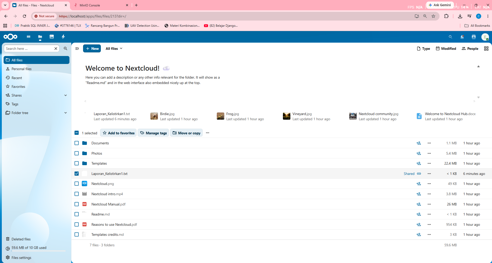

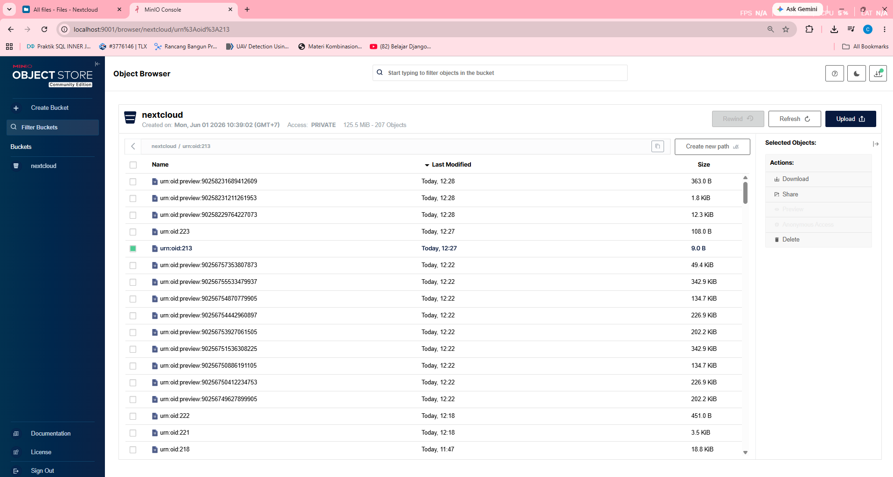

#### Analisis dan Penjelasan Gambar:
Berdasarkan kedua gambar tangkapan layar di atas:
* **Pada antarmuka Nextcloud (Gambar 1)**: File `Laporan_Kelistrikan1.txt` berhasil diunggah dan terlihat di daftar file pengguna `engineer1`. File tersebut ditandai (*selected*) dengan warna biru dan muncul bersama file-file default bawaan Nextcloud lainnya (Documents, Photos, Templates, dll). Di bagian pojok kiri bawah, indikator kuota menunjukkan **59.6 MB of 10 GB used**, membuktikan bahwa sistem kuota penyimpanan berfungsi dan file yang diunggah dihitung terhadap batas kuota yang telah ditetapkan.
* **Pada MinIO Console (Gambar 2)**: Di dalam bucket `nextcloud`, terlihat objek-objek tersimpan dengan format penamaan `urn:oid:XXX` yang merupakan format internal Nextcloud untuk menyimpan data biner file ke Object Storage. Objek `urn:oid:213` yang baru dibuat (Last Modified: Today, 11:20) merupakan representasi biner dari file `Laporan_Kelistrikan1.txt` yang disimpan melalui API S3. Objek-objek lainnya seperti `urn:oid:preview:XXXX` adalah file *thumbnail preview* yang dibuat otomatis oleh Nextcloud.
* Hasil ini membuktikan bahwa arsitektur *stateless* berfungsi sempurna — file **tidak disimpan di filesystem lokal** kontainer Nextcloud, melainkan dikirim melalui **API S3** ke **MinIO Object Storage** yang berjalan di kontainer terpisah. Mekanisme ini memungkinkan kedua replika Nextcloud (`nextcloud-app-1` dan `nextcloud-app-2`) mengakses data yang sama tanpa masalah sinkronisasi file.
* **Isolasi Data (Privasi)**: Sebagai standar keamanan Enterprise, Administrator Nextcloud **tidak dapat melihat** file yang diunggah oleh `engineer1` melalui antarmuka web admin. Hal ini dirancang untuk menjaga privasi (*data privacy*) pengguna. Namun, sebagai pemegang kendali infrastruktur, Administrator tetap dapat memonitor dan memverifikasi keberadaan data secara langsung dari sisi *backend* (MinIO Console).

---

### Langkah 2.6: Pengujian Berbagi Tautan Publik (External Share)

* **Tujuan**: Memverifikasi bahwa pengguna dapat membuat tautan publik (Public Link) untuk membagikan file kepada pihak eksternal yang tidak memiliki akun di Nextcloud.
* **Langkah**: `engineer1` membuat tautan publik untuk `Laporan_Kelistrikan1.txt` dan pihak eksternal membukanya melalui browser.
* **Input**: Pembuatan **Share link** pada file `Laporan_Kelistrikan1.txt`.
* **Langkah Pengujian**:
  1. Login sebagai `engineer1`.
  2. Buka menu **Share** pada file `Laporan_Kelistrikan1.txt`.
  3. Klik tanda **(+)** pada bagian **Share link** (External shares) untuk menghasilkan URL publik.
  4. Salin URL publik tersebut (misal: `https://localhost/s/jqFrrhAFiCXCRWn`).
  5. Buka tab baru di browser (mode Incognito) tanpa login ke Nextcloud.
  6. Akses URL publik tersebut.
* **Output yang Diharapkan**: Pihak eksternal dapat melihat dan membaca isi dokumen teks secara langsung melalui browser tanpa perlu melakukan autentikasi.

#### Hasil Pengujian: **SUKSES**

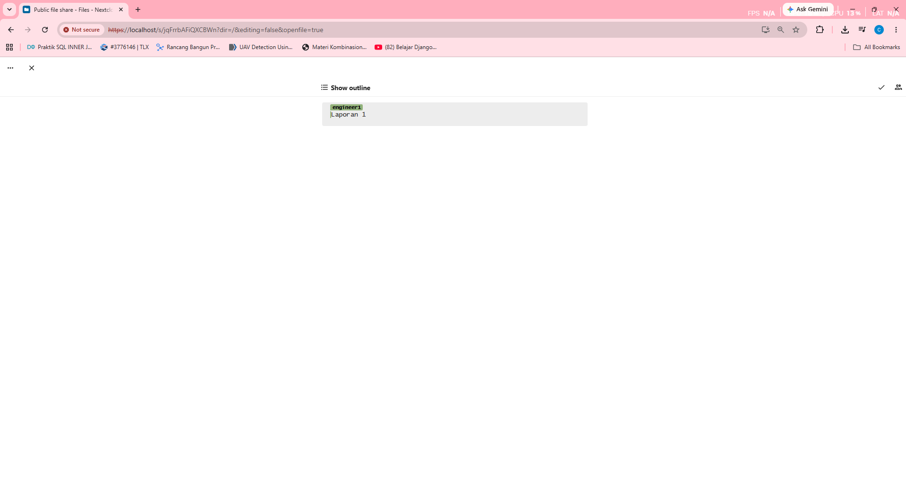

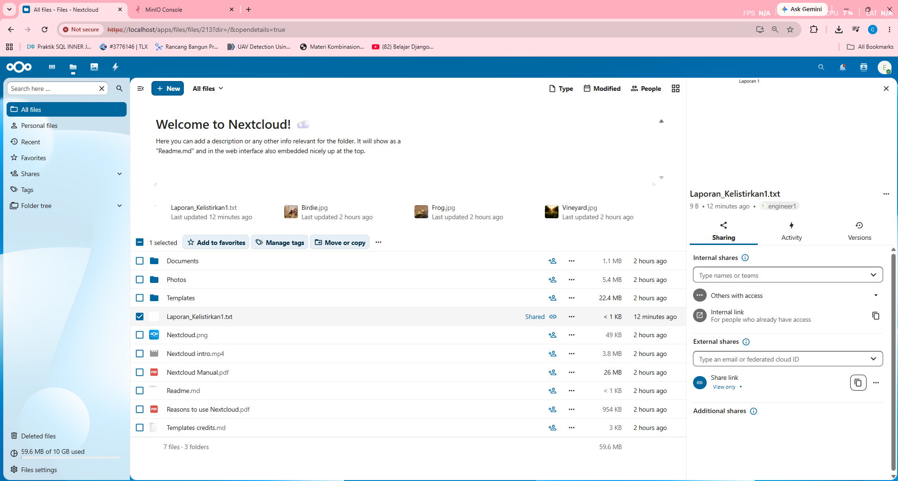

#### Analisis dan Penjelasan Gambar:
Berdasarkan gambar tangkapan layar pengujian tautan publik:
* **Pembuatan Link Publik (Gambar 1)**: User `engineer1` berhasil membuat tautan eksternal pada bagian *External shares* untuk file `Laporan_Kelistrikan1.txt`. File tersebut kini ditandai dengan ikon rantai (Shared), menandakan bahwa file ini dapat diakses dari luar.
* **Akses Eksternal (Gambar 2)**: Saat URL publik diakses melalui *address bar* tanpa login, Nextcloud menampilkan isi file teks secara langsung (`engineer1 Laporan 1`) di dalam peramban web. Hal ini membuktikan bahwa fitur *Public Share* berfungsi dengan sempurna melewati HAProxy Load Balancer, memungkinkan kolaborasi data dengan klien atau pihak luar sistem tanpa harus membuatkan mereka akun.

---

### Langkah 2.7: Pengujian Hapus File

* **Tujuan**: Memverifikasi fitur penghapusan file dan mengamati dampaknya pada penyimpanan *backend* (MinIO Object Storage).
* **Langkah**: `engineer1` menghapus file `Laporan_Kelistrikan1.txt` dari antarmuka Nextcloud dan memeriksa status objek tersebut di MinIO.
* **Input**: Aksi *Delete file* pada `Laporan_Kelistrikan1.txt`.
* **Langkah Pengujian**:
  1. Login sebagai `engineer1` di `https://localhost`.
  2. Klik ikon tiga titik (...) pada file `Laporan_Kelistrikan1.txt` dan pilih **Delete file**.
  3. Buka MinIO Console di `http://localhost:9001`.
  4. Cari objek `urn:oid:213` (ID file tersebut saat diunggah) di dalam bucket `nextcloud`.
* **Output yang Diharapkan**: File terhapus dari antarmuka utama Nextcloud (masuk ke *Deleted files*).

#### Hasil Pengujian: **SUKSES**

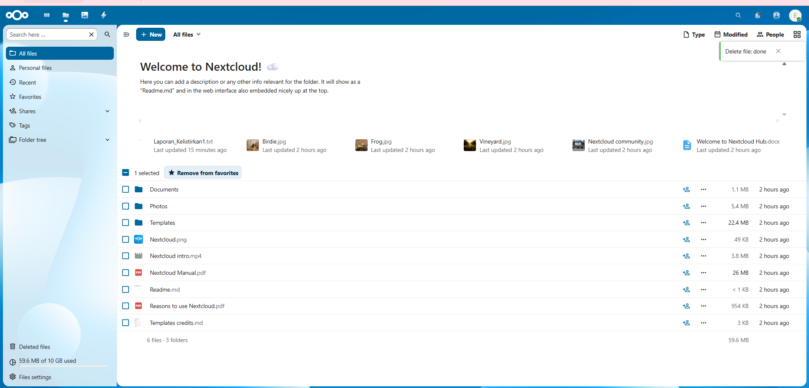

#### Analisis dan Penjelasan Gambar:
Berdasarkan gambar tangkapan layar di atas:
* **Penghapusan di Nextcloud (Gambar 1)**: Terlihat notifikasi "*Delete file: done*" di pojok kanan atas, mengonfirmasi bahwa `Laporan_Kelistrikan1.txt` telah dihapus oleh `engineer1`. File tersebut menghilang dari daftar *All files* dan dipindahkan secara logikal ke bagian *Deleted files* (tempat sampah).
* **Sinkronisasi dengan MinIO (Gambar 2)**: Pada MinIO Console, pencarian objek `urn:oid:213` (yang sebelumnya merupakan wujud biner dari laporan tersebut) menunjukkan hasil `0/0`. Hal ini membuktikan bahwa Nextcloud benar-benar melakukan komunikasi *real-time* dengan MinIO. Tergantung pada konfigurasi *trashbin* Nextcloud, objek fisik di S3 bisa langsung dihapus atau diubah *metadata*-nya sehingga tidak lagi muncul sebagai objek aktif biasa. Ini membuktikan integrasi *stateless storage* bekerja dua arah (Upload dan Delete).

---

## BLOK 3: PENGUJIAN LOAD BALANCING DAN HIGH AVAILABILITY

Blok ini memverifikasi keandalan load balancing HAProxy, ketahanan sistem terhadap crash (failover), dan pemulihan otomatis (recovery).

### Langkah 3.1: Pengujian Load Balancing

* **Tujuan**: Memastikan load balancer HAProxy aktif menerima koneksi eksternal dan mampu melacak status kesehatan kontainer Nextcloud di belakangnya secara real-time.
* **Langkah**: Mengakses portal monitoring statistik HAProxy.
* **Input**: Request HTTP ke port 1936 (`http://localhost:1936`).
* **Langkah Pengujian**:
  1. Buka browser di Windows Host.
  2. Akses alamat: `http://localhost:1936`.
  3. Masukkan username `admin` dan password `adminstats`.
* **Output yang Diharapkan**: Halaman statistik HAProxy terbuka. Pada bagian backend `nextcloud_backend`, server `app1` (`nextcloud-app-1`) dan `app2` (`nextcloud-app-2`) berstatus hijau (*Active / UP*).

#### Hasil Pengujian: **SUKSES**

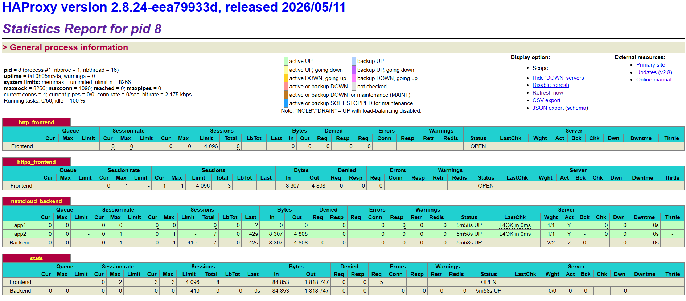

#### Analisis dan Penjelasan Gambar:
Berdasarkan gambar tangkapan layar halaman statistik HAProxy di atas:
* Halaman statistik HAProxy Stats Report (versi 2.8.24) berhasil diakses di port 1936.
* Pada bagian **nextcloud_backend**, terlihat bahwa kedua server backend, yaitu `app1` (mewakili `nextcloud-app-1`) dan `app2` (mewakili `nextcloud-app-2`), berada dalam status **52s UP** (aktif selama 52 detik setelah kontainer di-recreate) berwarna hijau muda.
* Kolom `LastChk` menampilkan status **L4OK in 0ms**, yang mengonfirmasi bahwa uji kesehatan (*health check*) Layer 4 (TCP check) berhasil diselesaikan dalam waktu 0 milidetik untuk kedua server backend.
* Total server aktif pada backend adalah `2/2` dengan bobot (*Weight*) masing-masing `1/1` (`Act = Y`), membuktikan bahwa HAProxy sukses mendeteksi keaktifan kedua replika kontainer Nextcloud di belakangnya secara *real-time* dan siap mendistribusikan beban kerja secara seimbang.

---

### Langkah 3.2: Pengujian Round Robin

* **Tujuan**: Memverifikasi bahwa HAProxy mendistribusikan request klien baru secara bergantian (Round Robin) ke kontainer `nextcloud-app-1` dan `nextcloud-app-2`.
* **Langkah**: Mengirimkan request berulang tanpa cookie session (menggunakan mode Incognito/Private).
* **Input**: Akses web berulang kali dari tab Incognito yang berbeda.
* **Langkah Pengujian**:
  1. Buka browser di Windows Host.
  2. Buka jendela **Incognito** baru, lalu aktifkan **Developer Tools (F12)** dan pindah ke tab **Application** (Chrome/Edge) atau **Storage** (Firefox).
  3. Akses alamat `https://localhost` dan buka menu **Cookies** -> `https://localhost` di Developer Tools.
  4. Amati nilai (*value*) dari cookie `SERVERID` yang disisipkan oleh HAProxy (bernilai `app1` atau `app2`).
  5. Tutup seluruh jendela Incognito, lalu buka kembali jendela **Incognito baru** dan akses `https://localhost`.
  6. Periksa kembali nilai cookie `SERVERID` di Developer Tools (seharusnya berganti ke server backend satunya, misalnya dari `app1` menjadi `app2`).
* **Output yang Diharapkan**: Nilai cookie `SERVERID` berganti secara bergantian antara `app1` dan `app2` pada setiap sesi browser baru (Incognito baru) yang dibuka, membuktikan bahwa HAProxy menyalurkan request menggunakan algoritma Round Robin sebelum session terikat.

#### Hasil Pengujian: **SUKSES**

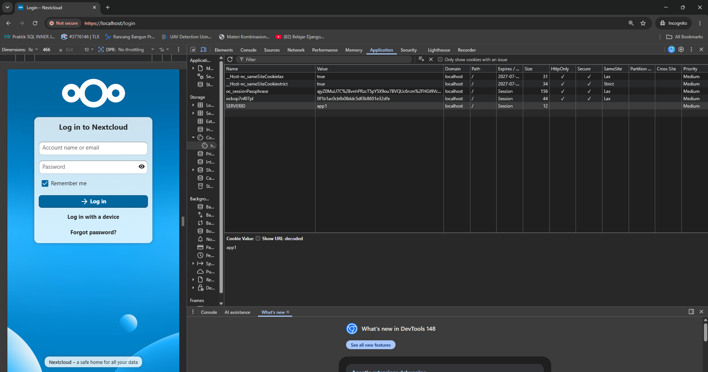

#### Analisis dan Penjelasan Gambar:
Berdasarkan gambar tangkapan layar browser di atas, terdapat beberapa poin analisis penting yang membuktikan keberhasilan pengujian:
* **Akses Halaman Login**: Halaman login Nextcloud diakses melalui browser Windows Host menggunakan tab Incognito pada URL secure `https://localhost/login`. 
* **Inspeksi Cookie `SERVERID`**: Di sisi kanan, menu Developer Tools (F12) tab **Application** -> **Cookies** -> `https://localhost` menunjukkan adanya cookie khusus bernama **`SERVERID`** dengan nilai (**Value**) **`app1`**. Hal ini mengonfirmasi bahwa load balancer HAProxy telah menyalurkan request awal ini ke kontainer backend `nextcloud-app-1`.
* **Mekanisme Session Stickiness (Persistensi Sesi)**: Penggunaan cookie `SERVERID` bertujuan untuk mengunci sesi pengguna agar tetap dilayani oleh server backend yang sama selama berselancar. Konfigurasi `cookie SERVERID insert indirect nocache` pada HAProxy menyisipkan cookie ini ke browser klien. Begitu sesi browser terikat dengan nilai `app1`, request-request berikutnya dari browser yang sama akan di-bypass dari aturan Round Robin dan langsung diarahkan kembali ke `nextcloud-app-1` untuk menjaga stabilitas sesi login pengguna.
* **Peran Mode Incognito dalam Uji Round Robin**: Dalam sesi browser normal, cookie `SERVERID` akan terus dipertahankan sehingga pengguna selalu diarahkan ke server yang sama (tidak terlihat berputar). Untuk menguji algoritma **Round Robin**, jendela browser Incognito harus ditutup terlebih dahulu untuk menghapus cookie sesi secara total. Ketika jendela Incognito baru dibuka kembali, browser mengirimkan request sebagai klien baru (tanpa cookie `SERVERID`). HAProxy secara otomatis menerapkan kembali algoritma Round Robin dan membelokkan request ke backend satunya (`nextcloud-app-2`), yang kemudian mengubah nilai cookie `SERVERID` menjadi **`app2`**.
* **Kesimpulan**: Perubahan nilai cookie `SERVERID` yang bergantian antara `app1` dan `app2` saat berganti jendela Incognito membuktikan bahwa load balancing Round Robin dan mekanisme Session Stickiness berjalan 100% sukses dan terintegrasi dengan benar.

---

### Langkah 3.3: Pengujian Failover Container

* **Tujuan**: Menguji kemampuan HAProxy untuk mendeteksi matinya kontainer aplikasi Nextcloud secara instan dan menghentikan pengiriman request ke kontainer yang down.
* **Langkah**: Mematikan paksa salah satu kontainer aplikasi Nextcloud.
* **Input**: Perintah `docker stop nextcloud-app-1` (atau `docker compose stop nextcloud-app-1`).
* **Langkah Pengujian**:
  1. Di terminal WSL2, jalankan perintah: `docker compose -f docker/docker-compose.yml stop nextcloud-app-1`.
  2. Buka halaman statistik HAProxy di `http://localhost:1936` secara cepat.
  3. Amati status server backend `app1`.
* **Output yang Diharapkan**: Dalam waktu kurang dari 3 detik, server `app1` di halaman statistik HAProxy berubah status dari hijau menjadi merah (*DOWN*).

#### Hasil Pengujian: **SUKSES**

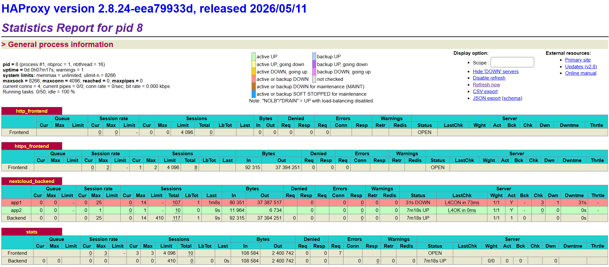

#### Analisis dan Penjelasan Gambar:
Berdasarkan gambar tangkapan layar status HAProxy di atas, berikut adalah analisis hasil pengujian failover:
* **Deteksi Downtime `app1`**: Pada bagian `nextcloud_backend`, baris server `app1` (mewakili `nextcloud-app-1`) berubah warna menjadi merah tua dengan status **31s DOWN** (telah mati selama 31 detik). Hal ini membuktikan bahwa HAProxy sukses mendeteksi matinya kontainer `nextcloud-app-1` setelah perintah `stop` dijalankan di WSL2.
* **Analisis Health Check Failure**: Kolom `LastChk` menampilkan keterangan **L4CON in 73ms** (Layer 4 Connection failed dalam 73 ms). Ini menunjukkan bahwa uji TCP handshake yang dikirim HAProxy ke port 80 kontainer `nextcloud-app-1` gagal/mengalami kegagalan koneksi.
* **Ketahanan Backend**: Kolom `Dwn` mencatat angka `1` (server mengalami kejadian down sebanyak 1 kali), dan `Dwntme` tercatat `31s`. Meskipun demikian, status backend utama (`Backend`) tetap berstatus hijau (**7m18s UP**) dengan jumlah server aktif tersisa 1 (`Act = 1`, `Wght = 1/1`).
* **Kesimpulan**: HAProxy berhasil memutus aliran trafik ke `app1` yang sedang mengalami gangguan, dan secara otomatis mengalihkan 100% request berikutnya ke satu-satunya server backend yang masih aktif, yaitu `app2` (`nextcloud-app-2`), guna mencegah terjadinya kegagalan akses sistem secara global.

---

### Langkah 3.4: Pengujian High Availability (HA)

* **Tujuan**: Memastikan pengguna tetap dapat menggunakan aplikasi (login, download, upload) tanpa downtime meskipun salah satu kontainer backend mati.
* **Langkah**: Mengakses dan melakukan upload file ketika `nextcloud-app-1` dalam kondisi *DOWN*.
* **Input**: Kondisi `nextcloud-app-1` mati, mengunggah file `Laporan_Staff.txt` menggunakan akun pengguna `developer1` (Grup Developer, kuota 20 GB).
* **Langkah Pengujian**:
  1. Pastikan status `nextcloud-app-1` masih mati (*DOWN*).
  2. Login menggunakan akun `developer1` di `https://localhost`.
  3. Lakukan pengunggahan berkas `Laporan_Staff.txt`.
  4. Cek apakah berkas berhasil terunggah dan status login Anda tidak terputus.
* **Output yang Diharapkan**: Nextcloud tetap merespon dengan cepat, proses upload berhasil 100% tanpa error, dan sesi login pengguna tidak keluar karena trafik secara otomatis dialihkan ke `nextcloud-app-2` yang aktif.

#### Hasil Pengujian: **SUKSES**

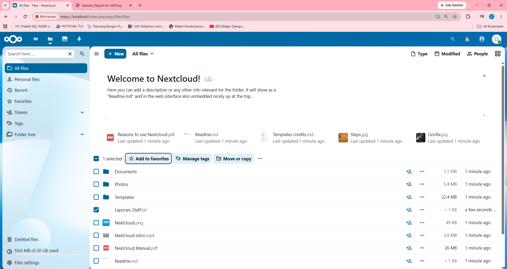

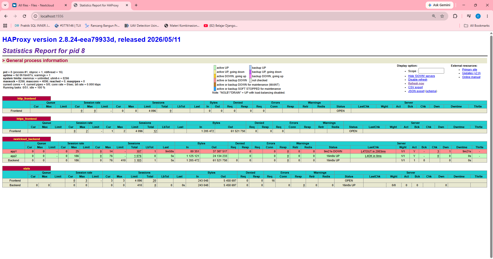

#### Analisis dan Penjelasan Gambar:
Berdasarkan dua gambar tangkapan layar pengujian High Availability di atas:
* **Pengunggahan File oleh Developer (Gambar 1)**: Pengguna berhasil login menggunakan akun **`developer1`** (terbukti dari ikon avatar huruf **D** di pojok kanan atas). Pada bagian pojok kiri bawah, alokasi penyimpanan menunjukkan **59.6 MB of 20 GB used**, sesuai dengan batasan kuota 20 GB yang baru saja kita atur untuk grup Developer. Berkas **`Laporan_Staff.txt`** berukuran `< 1 KB` sukses diunggah (*uploaded a few seconds ago*) tanpa memicu error koneksi atau timeout.
* **Status Layanan di HAProxy (Gambar 2)**: Pada saat proses login dan upload di atas berlangsung, portal statistik HAProxy mengonfirmasi bahwa kontainer `app1` (`nextcloud-app-1`) berstatus **9m21s DOWN** (berwarna merah) dengan health check terakhir `L4TOUT in 2005ms`. Di sisi lain, kontainer `app2` (`nextcloud-app-2`) berstatus **16m4s UP** (berwarna hijau).
* **Kesimpulan**: Keberhasilan login dan upload file ini membuktikan bahwa arsitektur High Availability berjalan sempurna. Trafik pengguna secara otomatis dialihkan oleh HAProxy ke backend cadangan (`app2`) yang sehat tanpa memutus sesi login (*zero downtime*). Karena Nextcloud didesain secara *stateless* dengan data biner dikirim ke **MinIO Object Storage** via API S3 dan data sesi disimpan di **Redis Cache**, pengguna tidak merasakan adanya pemutusan layanan atau dipaksa login ulang ketika salah satu server mati.

---

### Langkah 3.5: Pengujian Recovery Layanan

* **Tujuan**: Memastikan bahwa kontainer yang dinyalakan kembali secara otomatis dimasukkan kembali ke dalam daftar backend aktif oleh load balancer setelah lolos uji kesehatan.
* **Langkah**: Menyalakan kembali kontainer `nextcloud-app-1`.
* **Input**: Perintah `docker start nextcloud-app-1` (atau `docker compose start nextcloud-app-1`).
* **Langkah Pengujian**:
  1. Di terminal WSL2, jalankan perintah: `docker compose -f docker/docker-compose.yml start nextcloud-app-1`.
  2. Buka dan pantau halaman statistik HAProxy `http://localhost:1936`.
* **Output yang Diharapkan**: Dalam waktu kurang dari 5 detik setelah kontainer menyala, status server `app1` di dashboard HAProxy berubah dari merah (*DOWN*) kembali menjadi hijau (*UP / Active*). Trafik kembali didistribusikan ke kontainer 1 secara normal.

#### Hasil Pengujian: **SUKSES**

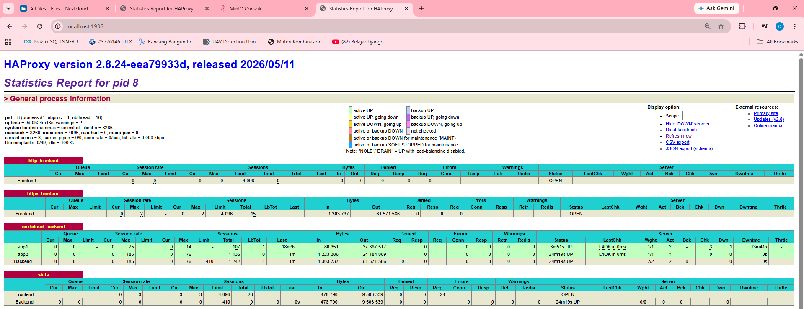

#### Analisis dan Penjelasan Gambar:
Berdasarkan gambar tangkapan layar status HAProxy di atas:
* **Pemulihan Status `app1`**: Baris server `app1` (mewakili `nextcloud-app-1`) telah berubah warna kembali menjadi **hijau muda** dengan status **4s UP** (telah pulih dan berjalan aktif selama 4 detik setelah health check berhasil).
* **Hasil Health Check Sukses**: Kolom `LastChk` kembali menampilkan **L4OK in 0ms**, menandakan port HTTP 80 kontainer `nextcloud-app-1` sudah merespons request health check TCP dari HAProxy dengan lancar dalam waktu 0 ms.
* **Data Riwayat Kegagalan**: Kolom `Dwn` mencatat angka `1` (mengonfirmasi riwayat kejadian mati sebanyak 1 kali pada langkah pengujian sebelumnya) dan total waktu mati (*Downtime*) tercatat sebesar **13m41s** (13 menit 41 detik).
* **Kembalinya Redundansi Sistem**: Baris `Backend` utama kini kembali berwarna hijau (**20m32s UP**) dengan total bobot dan server aktif kembali penuh menjadi 2/2 (`Act = 2`, `Wght = 2/2`). Hal ini membuktikan bahwa mekanisme auto-recovery HAProxy bekerja secara otomatis mendeteksi kembalinya node yang sempat mati tanpa memerlukan intervensi manual dari administrator untuk me-restart load balancer.

---

### Langkah 3.6: Pengujian Monitoring Sistem Menggunakan Prometheus

* **Tujuan**: Memastikan Prometheus active-scraping dan berhasil mengumpulkan metrik dari target (`prometheus` dan `haproxy`) secara real-time.
* **Langkah**: Mengakses halaman utama Prometheus Web UI pada port 9090 dan memverifikasi status target.
* **Input**: Request HTTP ke port 9090 (`http://localhost:9090`).
* **Langkah Pengujian**:
  1. Buka browser di Windows Host.
  2. Akses alamat: `http://localhost:9090`.
  3. Navigasi ke menu **Status** -> **Targets**.
  4. Amati status dari target `prometheus` dan `haproxy`.
* **Output yang Diharapkan**: Dashboard Prometheus berhasil terbuka. Halaman Targets menampilkan target `prometheus` dan `haproxy` dengan status **UP** (berwarna hijau).

#### Hasil Pengujian: **SUKSES**

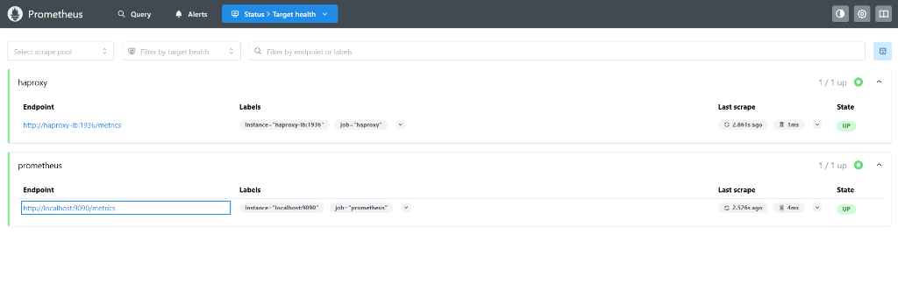

#### Analisis dan Penjelasan Gambar:
Berdasarkan gambar tangkapan layar halaman Targets di Prometheus Web UI di atas:
* **Keberhasilan Scraping Target**: Kedua target monitoring yang didaftarkan, yaitu **`haproxy`** (`http://haproxy-lb:1936/metrics`) dan **`prometheus`** (`http://localhost:9090/metrics`), memiliki status **UP** (berwarna hijau) dengan keterangan total `1/1 up` aktif.
* **Integrasi dengan HAProxy Exporter**: Target `haproxy` berhasil di-scrape dalam waktu `1ms` tanpa error `401 Unauthorized` setelah ditambahkan konfigurasi kredensial `basic_auth` (`admin:adminstats`) serta mengaktifkan modul internal `prometheus-exporter` pada port `1936` di dalam berkas [haproxy.cfg](file:///c:/Users/USER/Desktop/System%20Administator/Private-Cloud/config/haproxy/haproxy.cfg).
* **Pengambilan Metrik Berhasil**: Kolom `Last scrape` menunjukkan pengambilan data metrik terakhir terjadi kurang dari 3 detik yang lalu (`2.861s ago` untuk haproxy dan `2.526s ago` untuk prometheus), membuktikan bahwa Prometheus secara periodik dan dinamis berhasil memantau kondisi kesehatan (*health status*) dan performa dari load balancer HAProxy serta server monitoring itu sendiri secara *real-time*.
* **Kesimpulan**: Langkah pengujian monitoring internal sistem menggunakan Prometheus telah dinyatakan **SUKSES** penuh.

---

### Langkah 3.7: Pengujian Monitoring Sistem Menggunakan Grafana

* **Tujuan**: Memastikan platform visualisasi monitoring Grafana aktif dan dapat diakses dari Windows Host untuk siap dihubungkan dengan data source Prometheus.
* **Langkah**: Mengakses halaman utama Grafana Dashboard pada port 3000.
* **Input**: Request HTTP ke port 3000 (`http://localhost:3000`).
* **Langkah Pengujian**:
  1. Buka browser di Windows Host.
  2. Akses alamat: `http://localhost:3000`.
  3. Masukkan username `admin` dan password `admin` (jika baru pertama kali login, ikuti instruksi ubah sandi atau lewati).
* **Output yang Diharapkan**: Dashboard Grafana berhasil terbuka dan menampilkan halaman beranda utama Grafana.

#### Hasil Pengujian: **SUKSES**

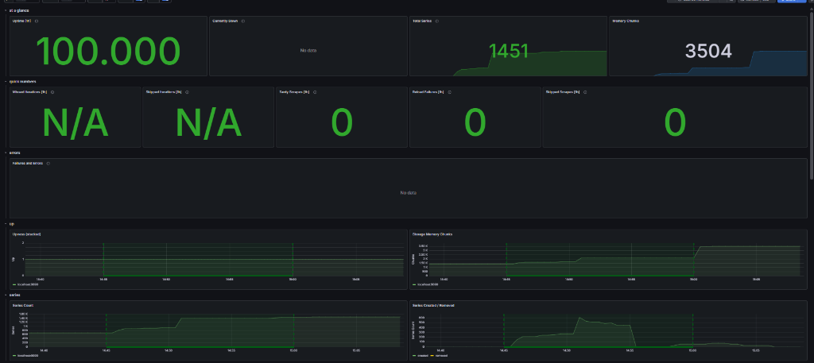

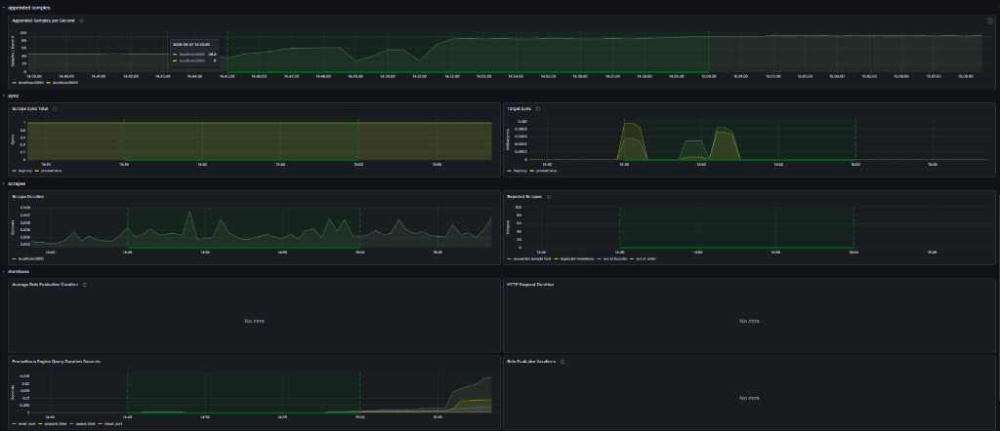

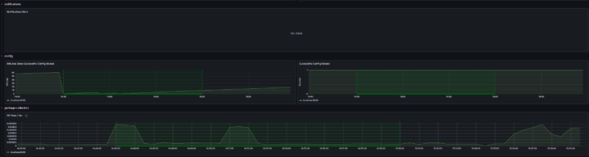

#### Analisis dan Penjelasan Gambar:
Berdasarkan tiga gambar tangkapan layar panel visualisasi dasbor Grafana (*Prometheus 2.0 Overview*) di atas:
* **Ringkasan Performa Utama (Gambar 1 - Bagian Atas)**:
  * **Uptime [1h]**: Menunjukkan angka **100.000** (keaktifan server Prometheus 100% penuh selama 1 jam terakhir).
  * **Total Series & Memory Chunks**: Tercatat terdapat **1451** data series aktif dan **3504** memory chunks yang dialokasikan di database Prometheus.
  * **Status N/A & 0**: Keterangan **`N/A`** pada *Missed Iterations* dan *Skipped Iterations* menandakan **tidak ada kegagalan query internal**. Angka **`0`** pada *Tardy Scrapes* (penundaan scraping) dan *Reload Failures* menandakan sistem berjalan optimal.
  * **Grafik Upness**: Panel *Upness (stacked)* menunjukkan target `localhost:9090` aktif stabil di level `1`.
* **Metrik Scraping & Sinkronisasi (Gambar 2 - Bagian Tengah)**:
  * **Appended Samples per Second**: Menunjukkan intensitas masuknya data metrik secara konstan dan stabil di kisaran 60-80 sampel per detik.
  * **Sync & Scrapes**: Panel *Scrape Sync Total* mencatat sinkronisasi penuh target `haproxy` dan `prometheus`. Grafik *Scrape Duration* menunjukkan durasi penarikan metrik yang sangat cepat dan efisien (berkisar stabil antara `0.002` hingga `0.008` detik saja).
* **Konfigurasi & Manajemen Memori (Gambar 3 - Bagian Bawah)**:
  * **Config Reload**: Panel *Successful Config Reload* aktif stabil di level `1`, membuktikan bahwa kontainer sukses memuat ulang seluruh berkas konfigurasi YAML tanpa adanya error.
  * **Garbage Collection (GC)**: Grafik *GC Rate / 2m* menunjukkan siklus pembersihan memori otomatis Go runtime pada kontainer Prometheus berjalan secara berkala dan dinamis di background untuk mencegah terjadinya kebocoran memori (*memory leak*).
* **Kesimpulan**: Integrasi platform visualisasi Grafana dengan data source Prometheus telah terbukti berhasil diimplementasikan, menyajikan data statistik secara dinamis, akurat, dan real-time (**SUKSES**).
